# 디지털공학 5장 보조학습자료 (1/2)
### 순차논리 개요 · 래치 · 플립플롭 · 클럭형 순차회로 해석

> 이 자료는 교재의 핵심 개념과 풀이 과정을 본문 서술로 정리한 복습용 보조자료입니다.  
> Mano, *Digital Design* 5장과 함께 활용하세요.

---

## 목차

- [1. 순차논리 개요](#1-순차논리-개요)
- [2. 래치](#2-래치)
- [3. 플립플롭](#3-플립플롭)
- [4. 클럭형 순차회로 해석](#4-클럭형-순차회로-해석)

---

## 1. 순차논리 개요

### 학습목표

- 순차논리 회로의 구조와 특성을 조합논리와 비교하여 설명할 수 있다.
- 동기식과 비동기식 순차논리의 차이를 이해한다.

---

### 1.1 순차논리 회로란?

4장에서 다룬 조합논리는 **현재 입력만으로 출력이 결정**되었습니다.  
**순차논리(Sequential Logic)** 는 여기에 **저장회로(기억 소자)** 가 추가된 회로입니다.

$$\text{출력} = F(\text{현재 입력},\; \text{저장된 이전 상태})$$

즉, 출력이 현재 입력뿐 아니라 **과거에 어떤 상태였는지에도 의존**합니다.

**블록 구조:**

```
          ┌─────────────────────────────┐
 입력 ───▶│  조합 논리 회로              │──▶ 출력
          │            │                │
          │    ┌───────▼────────┐       │
          │    │ 저장회로(FF)   │       │
          │    │ (현재 상태 유지)│       │
          │    └───────┬────────┘       │
          └────────────┘                │
                  ↑
                클럭 (동기식의 경우)
```

- 클럭은 **저장회로에만** 인가됩니다. 조합논리는 언제나 다음 상태를 계산하고, 그 결과를 상태로 받아들이는 시점은 클럭이 정합니다(교재 Fig 5.2 참고).

> 💡 **비유**: 조합논리가 "지금 누른 버튼에 즉시 반응하는 전등 스위치"라면,  
> 순차논리는 "누른 횟수를 기억하고 짝수번째에만 켜지는 스위치"입니다.

---

### 1.2 조합논리 vs 순차논리

| 구분 | 조합논리 | 순차논리 |
|---|---|---|
| 출력 결정 요소 | 현재 입력만 | 현재 입력 + 저장된 이전 상태 |
| 저장 소자 | 없음 | 있음 (래치, 플립플롭) |
| 시간 의존성 | 없음 | 있음 |
| 대표 회로 | 가산기, MUX, 디코더 | 레지스터, 카운터, FSM |
| 다루는 장 | 4장 | 5장, 8장 |

---

### 1.3 동기식 vs 비동기식

**비동기식 순차논리:**

- 각 입력 신호의 **변화 순서**에 의해 출력이 변합니다.
- 피드백이 있는 조합회로로 구성되어, 회로가 **불안정한 상태**에 빠질 수 있습니다.
- 실제 설계에서는 잘 사용하지 않으며, 본 강의에서는 상세히 다루지 않습니다.

**동기식 순차논리:**

- **클럭 펄스(동기신호)** 에 의해 회로의 동작 시점이 결정됩니다.
- 레벨 응답(Level Response)과 에지 응답(Edge Response) 두 가지로 구분합니다.
- 현대 디지털 시스템 설계의 표준 방식입니다.

| 구분 | 동기식 | 비동기식 |
|---|---|---|
| 동작 시점 | 클럭에 의해 결정 | 입력 신호 변화에 의해 즉시 결정 |
| 안정성 | 높음 | 낮음 (불안정 위험) |
| 설계 난이도 | 상대적으로 체계적 | 복잡 |
| 사용 빈도 | 높음 | 낮음 |

---

---

## 2. 래치

### 학습목표

- SR-Latch의 동작 원리와 Active High/Low 차이를 설명할 수 있다.
- Enable 신호를 가진 SR-Latch와 D-Latch의 동작 차이를 이해한다.

---

### 2.1 래치란?

**래치(Latch)** 는 **입력 신호의 레벨에 반응하는 비동기식 저장 소자**입니다.  
일종의 **쌍안정(Bistable) 논리소자** 또는 **멀티바이브레이터(Multivibrator)** 라고도 부릅니다.

쌍안정이란, **안정된 상태가 두 가지($Q=0$, $Q=1$)** 이며  
외부 입력이 없는 한 현재 상태를 유지한다는 뜻입니다.

> 💡 저장 소자의 가장 기본적인 요구사항은 **상태 변화 명령이 있을 때까지 상태를 유지**하는 것입니다.  
> 래치는 이 요구사항을 가장 단순한 게이트 회로로 구현한 것입니다.

---

### 2.2 Active High SR-Latch

**SR-Latch**는 Set($S$)과 Reset($R$) 두 입력을 가진 가장 기본적인 래치입니다.

**진리표 (Active High: NOR 게이트 기반):**

| $S$ | $R$ | $Q(t+1)$ | 동작 |
|:---:|:---:|:---:|:---:|
| 0 | 0 | $Q(t)$ | **유지** (No Change) |
| 0 | 1 | 0 | **Reset** |
| 1 | 0 | 1 | **Set** |
| 1 | 1 | × | **금지** (Forbidden) |

> ⚠️ $S = R = 1$은 **금지 상태**입니다.  
> 두 입력이 동시에 1이 되면 $Q$와 $Q'$가 모두 0이 되어 정의되지 않은 상태가 됩니다.  
> 이 상태는 반드시 피해야 합니다.

**구현 (NOR 게이트):**

```
S ──┬──[NOR]──┬── Q
    │    ↑    │
R ──┼────┘    └── Q'
    │              │
    └──[NOR]───────┘
```

> 📖 **그림은 교재 참고** — Mano 6판 Fig 5.3 (SR latch with NOR gates): 회로도와 기능표

**왜 값이 유지되는가 — 두 게이트의 상호 출력 유지**

NOR 게이트는 입력 가운데 하나라도 1이면 출력이 0이고, 두 입력이 모두 0일 때만 1을 냅니다. $(S, R) = (0, 0)$이면 외부 입력이 모두 0이므로, 각 게이트의 출력은 상대 게이트에서 되돌아온 값 하나로 정해집니다.

| 저장값 | 위 게이트 입력 $(R, Q')$ | 위 게이트 출력 $Q$ | 아래 게이트 입력 $(S, Q)$ | 아래 게이트 출력 $Q'$ |
|:---:|:---:|:---:|:---:|:---:|
| $Q = 1$ | (0, 0) | 1 | (0, 1) | 0 |
| $Q = 0$ | (0, 1) | 0 | (0, 0) | 1 |

- 두 경우 모두 출력이 입력으로 돌아가 같은 출력을 다시 만들어 냅니다. 외부 입력 없이 값이 유지되는 이유입니다.
- 안정된 상태가 두 개($Q = 0$ · $Q = 1$)이므로 이러한 회로를 쌍안정(bistable) 회로라고 합니다(2.1절).

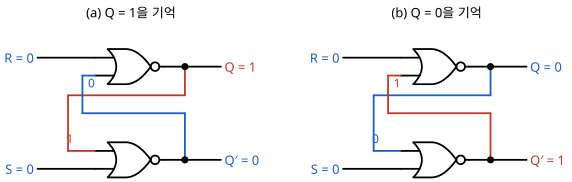

**Set 동작의 전파 — 게이트를 하나씩 거치는 변화**

초기 $Q = 0$에서 $S$를 1로 올리면 값은 게이트를 하나씩 거치며 바뀝니다. 게이트 하나의 지연을 $t_d$라 합니다.

| 시점 | $S$ | 아래 게이트 $Q' = \overline{S + Q}$ | 위 게이트 $Q = \overline{R + Q'}$ | 설명 |
|:---:|:---:|:---:|:---:|---|
| $t_0$ 직전 | 0 | 1 | 0 | 유지 상태 |
| $t_0$ | 1 | 1 | 0 | 입력만 바뀌고 출력은 변화 없음 |
| $t_0 + t_d$ | 1 | **0** | 0 | 아래 게이트가 먼저 반응 |
| $t_0 + 2t_d$ | 1 | 0 | **1** | 바뀐 $Q'$를 받아 위 게이트가 반응 · 안정 |

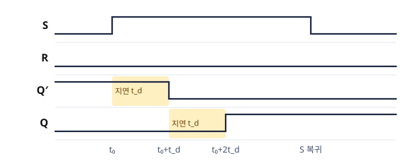

- Set이 완료되려면 $S$가 $2t_d$ 이상 1이어야 합니다. 그보다 짧으면 $Q$가 바뀌기 전에 입력이 사라집니다.
- Reset에서는 위아래 게이트의 역할만 바뀌어 같은 과정이 진행됩니다.

**왜 $S = R = 1$은 금지인가 — 경쟁 상태**

- $(1, 1)$이면 두 게이트 모두 입력에 1이 있으므로 $Q = Q' = 0$입니다. 두 출력이 보수 관계를 잃습니다.
- 이어서 두 입력을 동시에 0으로 내리면 두 게이트가 같은 입력 $(0, 0)$을 받아 동시에 1로 바뀌고, 다시 서로 1을 받아 동시에 0으로 바뀝니다.
- 두 게이트의 지연이 정확히 같다면 이 진동이 계속됩니다. 실제 소자에서는 지연의 미세한 차이로 한쪽 값에 정착하지만, 어느 값에 정착할지는 회로도로 정할 수 없습니다. 이 현상을 **경쟁 상태**(race)라고 합니다.

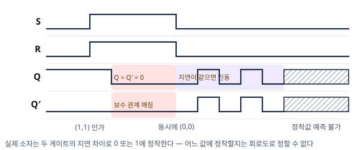

#### 예제 2-1 — SR 래치 시퀀스 추적

SR 래치(초기 $Q = 1$)에 $(S, R) = (0,0) \to (0,1) \to (0,0) \to (1,0)$을 순서대로 가할 때 $Q$를 추적하라.

<details>
<summary>풀이 보기</summary>


단계마다 동작표의 해당 행을 적용합니다.

| 단계 | $(S,R)$ | 동작 | $Q$ |
|:---:|:---:|---|:---:|
| 1 | (0,0) | 유지 | 1 |
| 2 | (0,1) | Reset | **0** |
| 3 | (0,0) | 유지 | 0 |
| 4 | (1,0) | Set | **1** |

**검산**: $(0,0)$에서 값이 두 번 모두 유지되었습니다. 마지막에 $(1,1)$을 가하면 $Q = Q' = 0$이 되어, 그다음 $(0,0)$에서 $Q$가 가질 값을 예측할 수 없게 됩니다. 이것이 금지인 이유입니다.

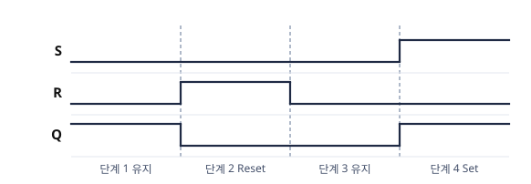

</details>

---

### 2.3 Active Low SR-Latch

**Active Low SR-Latch**는 NAND 게이트로 구현하며,  
입력 신호가 **0(Low)일 때 활성화**됩니다.

**진리표 (Active Low: NAND 게이트 기반):**

| $S'$ | $R'$ | $Q(t+1)$ | 동작 |
|:---:|:---:|:---:|:---:|
| 1 | 1 | $Q(t)$ | **유지** |
| 1 | 0 | 0 | **Reset** |
| 0 | 1 | 1 | **Set** |
| 0 | 0 | × | **금지** |

> 💡 Active High와 입력 극성이 **반대**입니다.  
> 이 때문에 실제 회로 기호에서 입력 핀에 버블(○)이 표시됩니다.

- NAND는 입력 가운데 하나라도 0이면 출력이 1입니다. 0이 인가된 입력이 출력을 정하므로 0이 동작 신호가 되고, 동작하지 않을 때의 평소 값은 1입니다.
- 표는 NOR형과 상하 반전된 형태입니다. 기억 행이 $(1,1)$, 금지 행이 $(0,0)$이며, 금지 입력에서는 $Q = Q' = 1$이 됩니다.
- 실제 부품(예: 74HC00)과 Logisim 라이브러리의 SR 래치는 대개 이 NAND형이므로 두 표를 모두 읽을 수 있어야 합니다.

> 📖 **그림은 교재 참고** — Mano 6판 Fig 5.4 (SR latch with NAND gates)

#### 예제 2-2 — NAND형 래치의 금지 입력 (심화)

NAND형 SR 래치(초기 $Q = 0$)에 $(S', R') = (1,1) \to (0,1) \to (1,1) \to (0,0) \to (1,1)$을 순서대로 가할 때 $Q$를 추적하고, 마지막 단계의 값을 예측할 수 없는 이유를 쓰라.

<details>
<summary>풀이 보기</summary>


| 단계 | $(S',R')$ | 동작 | $Q$ |
|:---:|:---:|---|:---:|
| 1 | (1,1) | 유지 | 0 |
| 2 | (0,1) | Set | **1** |
| 3 | (1,1) | 유지 | 1 |
| 4 | (0,0) | 금지 | $Q = Q' = 1$ |
| 5 | (1,1) | ? | **예측 불가** |

**검산**: 단계 4에서 두 NAND 모두 입력에 0을 받아 출력이 동시에 1이 됩니다. 단계 5에서 두 입력이 동시에 1로 복귀하면, 어느 게이트가 먼저 반응하는가(게이트 지연의 미세한 차이)에 따라 $Q$가 0 또는 1로 정해집니다. 회로도로는 답할 수 없는 경쟁 상태이며, NOR형의 $(1,1) \to (0,0)$과 같은 현상입니다.

- 단계 5를 "유지"로 처리하지 않도록 주의합니다. 유지는 직전 값이 정상적인 보수 쌍일 때만 성립합니다.

</details>

#### 예제 2-3 — 활성 로우 입력의 판독 (심화)

NAND형 SR 래치(초기 $Q = 0$)에 $(S', R') = (1,0) \to (1,1) \to (0,1)$을 순서대로 가했다. 한 학생이 아래와 같이 답했다. 처음 틀린 단계를 찾고, 원인과 바른 답을 적어라.

| 단계 | $(S',R')$ | 학생의 판단 | 학생의 $Q$ |
|:---:|:---:|---|:---:|
| 1 | (1,0) | Set | 1 |
| 2 | (1,1) | 금지 | ? |
| 3 | (0,1) | Reset | 0 |

<details>
<summary>풀이 보기</summary>


- 처음 틀린 단계는 **1**입니다. 학생이 활성 로우 입력을 NOR형(활성 하이) 표로 읽었고, 그 결과 모든 단계의 판단이 뒤집혔습니다.

| 단계 | $(S',R')$ | 바른 판단 | $Q$ |
|:---:|:---:|---|:---:|
| 1 | (1,0) | Reset ($R' = 0$이 동작) | 0 |
| 2 | (1,1) | 유지 (평상시) | 0 |
| 3 | (0,1) | Set ($S' = 0$이 동작) | **1** |

**검산**: NAND형에서 $(1,1)$은 "어느 입력도 동작하지 않음", 즉 유지입니다. 학생 답의 "금지"는 NOR형의 $(1,1)$ 행을 적용한 결과입니다.

</details>

---

### 2.4 Enable 신호를 가진 SR-Latch

기본 SR-Latch에 **Enable(E) 신호**를 추가해,  
$E = 1$일 때만 $S/R$ 입력이 반영되도록 제어합니다.

$$E = 0 \Rightarrow \text{입력 무시, 현재 상태 유지}$$
$$E = 1 \Rightarrow S, R \text{ 입력 정상 동작}$$

**동작표:**

| $E$ | $S$ | $R$ | $Q(t+1)$ |
|:---:|:---:|:---:|:---:|
| 0 | × | × | $Q(t)$ |
| 1 | 0 | 0 | $Q(t)$ |
| 1 | 0 | 1 | 0 |
| 1 | 1 | 0 | 1 |
| 1 | 1 | 1 | × |

회로는 NAND형 SR 래치 앞에 NAND 게이트 2개를 둔 구조입니다.

- $E = 0$이면 앞단 NAND 두 개의 출력이 모두 1이 됩니다. 뒤의 NAND 래치는 평상시 입력 $(1, 1)$을 받으므로 값을 유지합니다.
- $E = 1$이면 앞단 NAND가 $S, R$을 반전해 전달합니다. 활성 로우인 NAND 래치에 반전된 값이 인가되므로, 전체적으로는 $S, R$이 1일 때 동작하는 활성 하이와 같습니다.

> 📖 **그림은 교재 참고** — Mano 6판 Fig 5.5 (SR latch with control input)

---

### 2.5 D-Latch

**D-Latch**는 Enable SR-Latch에서 $S = R = 1$이 되는 금지 상태를 **원천적으로 없앤** 래치입니다.  
$S$와 $R$에 동일한 입력 $D$를 연결하되, $R = D'$로 연결합니다.

$$S = D, \quad R = D'$$

이렇게 하면 $S$와 $R$이 항상 반대 값을 가지므로 $S = R = 1$ 상태가 불가능해집니다.

**동작표:**

| $E$ | $D$ | $Q(t+1)$ | 동작 |
|:---:|:---:|:---:|:---:|
| 0 | × | $Q(t)$ | 유지 |
| 1 | 0 | 0 | Reset |
| 1 | 1 | 1 | Set |

> 💡 D-Latch는 "$E = 1$인 동안 $D$ 값을 그대로 따라가고,  
> $E = 0$이 되는 순간의 $D$ 값을 저장"하는 소자입니다.  
> 이 '따라가는 동작'이 이후 플립플롭 설계에서 문제를 일으키는 원인이 됩니다.

- $E = 1$인 동안 $Q$가 $D$를 그대로 따라가는 동작을 **투과**(transparent)라고 합니다.
- $E = 1$이면 $(S, R)$은 항상 $(1, 0)$ 또는 $(0, 1)$이므로 매 순간 Set 또는 Reset이 일어납니다. $Q$가 $D$를 따라가는 이유입니다.
- $E = 0$이면 앞단 NAND가 입력을 차단하므로(2.4절) 래치는 $E$가 내려가기 직전의 $D$를 유지합니다.

> 📖 **그림은 교재 참고** — Mano 6판 Fig 5.6 (D latch)

#### 예제 2-4 — D 래치 추적

D 래치(초기 $Q = 0$)에서 $E$와 $D$가 다음처럼 변할 때 $Q$를 추적하라. (아래 그림의 $En$은 이 자료의 $E$입니다.)

| 구간 | $E$ | $D$의 변화 |
|:---:|:---:|---|
| ① | 1 | $1 \to 0$ |
| ② | 0 | $0 \to 1$ |
| ③ | 1 | $1$ 유지 |
| ④ | 0 | $1 \to 0$ |

<details>
<summary>풀이 보기</summary>


$E = 1$이면 $Q = D$, $E = 0$이면 유지입니다.

| 구간 | $E$ | $D$의 변화 | $Q$ |
|:---:|:---:|---|:---:|
| ① | 1 | $1 \to 0$ | $1 \to 0$ (따라감 — 투과) |
| ② | 0 | $0 \to 1$ | **0 유지** (직전 값) |
| ③ | 1 | $1$ 유지 | **1** (다시 따라감) |
| ④ | 0 | $1 \to 0$ | **1 유지** |

**검산**: ①에서 $Q$가 구간 도중에 두 번 바뀌었습니다. $E = 1$인 동안 $D$의 모든 변화가 통과합니다. 이 "도중에 바뀜"이 2.6절에서 다룰 문제입니다.

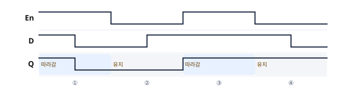

</details>

---

### 2.6 래치의 한계 — 왜 플립플롭이 필요한가?

D-Latch는 $E = 1$인 **레벨 구간 전체** 동안 $D$ 입력이 반영됩니다.  
이 구간 중 $D$ 입력이 변하면 출력도 계속 바뀌어 **출력 불안정** 문제가 발생합니다.

```
E  ────────┐         ┌────
           │         │
           └─────────┘
D  ──0──1──0──1──0──── (E 구간 중 계속 변화)
Q  ──0──1──0──1──0──── (출력도 따라서 불안정)
```

이 문제를 해결하기 위해 클럭의 **특정 에지(Rising/Falling Edge)** 에만 반응하는  
**플립플롭(Flip-Flop)** 이 필요합니다.

래치를 순차회로의 피드백 구조(1.1절)에 사용하면, $E = 1$인 한 구간 동안 값이 조합논리를 여러 차례 거치며 연쇄적으로 바뀔 수 있습니다. 상태가 "클럭당 정확히 한 번"만 바뀌어야 하는 순차회로에는 부적합합니다.

> 💡 필요한 것은 "문이 열려 있는 동안"이 아니라 "**문이 열리는 순간**"에만 값을 받는 장치입니다. 그것이 에지 트리거 플립플롭입니다.

#### 예제 2-5 — 출력을 되돌린 D 래치 (심화)

D 래치의 $Q'$ 출력을 $D$ 입력에 연결했다($D = Q'$). 초기 $Q = 0$이다. $E$는 0에서 1로 올라가 일정 시간 1을 유지한 뒤 0으로 내려간다. 래치가 $D$의 변화를 $Q$에 반영하는 지연을 $t_d$라 할 때, $E = 1$ 구간과 그 뒤의 $Q$를 추적하라.

<details>
<summary>풀이 보기</summary>


투과 동작과 $D = Q'$ 연결을 함께 적용합니다.

| 시점 | $D = Q'$ | $Q$ | 설명 |
|:---:|:---:|:---:|---|
| $E$ 상승 직후 | 1 | 0 | 래치가 열려 $D = 1$이 통과하기 시작 |
| $+t_d$ | 0 | 1 | $Q$가 1이 되자 $D$가 0으로 바뀜 |
| $+2t_d$ | 1 | 0 | 열려 있으므로 바뀐 $D$가 다시 통과 |
| $+3t_d$ | 0 | 1 | 같은 과정 반복 |

- $E = 1$인 동안 $Q$는 $t_d$마다 반전됩니다. 이것이 진동입니다. 바뀌는 횟수는 $E = 1$ 구간 길이 ÷ $t_d$로 정해집니다.
- $E$가 0으로 내려가면 그 순간의 값이 유지되지만, 0인지 1인지는 구간 길이와 지연에 달려 있어 미리 정할 수 없습니다.

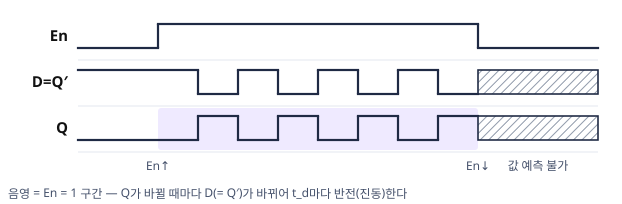

**검산**: 같은 연결($D = Q'$)을 에지 트리거 D 플립플롭에 적용하면 $Q$가 클럭 에지마다 정확히 한 번 반전됩니다(예제 3-9). 투과 동작이 있을 때와 없을 때의 차이입니다.

</details>

#### 예제 2-6 — Q 파형에서 D 복원하기 (심화)

D 래치의 $En$($= E$)과 $Q$ 파형이 아래와 같다(초기 $Q = 0$). 이 $Q$를 만들려면 $D$는 각 구간에서 어떤 값이어야 하는가? $Q$에 영향을 주지 않는 구간은 ×로 표시하라.

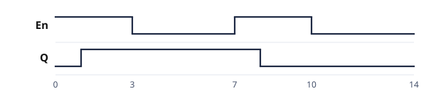

<details>
<summary>풀이 보기</summary>


$E = 1$이면 $Q = D$, $E = 0$이면 유지입니다.

| 구간 | $E$ | $Q$ | 필요한 $D$ |
|:---:|:---:|:---:|:---:|
| 0\~1 | 1 | 0 | 0 |
| 1\~3 | 1 | 1 | 1 |
| 3\~7 | 0 | 1 (유지) | × |
| 7\~8 | 1 | 1 | 1 |
| 8\~10 | 1 | 0 | 0 |
| 10\~14 | 0 | 0 (유지) | × |

- $E = 1$ 구간에서는 래치가 투과 상태이므로 $D = Q$여야 합니다.
- $E = 0$ 구간의 $D$는 $Q$에 영향을 주지 않습니다. 다만 $E$가 내려가는 순간($t$ = 3 · 10) 직전의 $D$가 유지값이 되므로 그 값은 정해져 있어야 합니다.

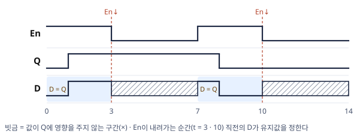

**검산**: 구한 $D$로 투과·유지 규칙을 다시 적용하면 문제의 $Q$ 파형이 그대로 얻어집니다. 결과에서 입력을 찾는 문제는 이와 같이 정방향으로 다시 확인합니다.

</details>

---

### 2.7 복습문제

#### 문제 (1)

SR 래치(NOR형)에 입력 시퀀스 $(S,R) = (1,0) \to (0,0) \to (0,1) \to (0,0)$을 순서대로 가할 때 $Q$의 변화를 추적하라. (초기 $Q = 0$)

<details>
<summary>정답 및 풀이 보기</summary>


| 단계 | $(S,R)$ | 동작 | $Q$ |
|:---:|:---:|---|:---:|
| 1 | (1,0) | Set | **1** |
| 2 | (0,0) | 유지 | 1 |
| 3 | (0,1) | Reset | **0** |
| 4 | (0,0) | 유지 | 0 |

$(0,0)$ 구간에서 값이 유지되는 것이 "기억"입니다. 입력을 제거해도 정보가 남습니다.

</details>

---

#### 문제 (2)

Enable 신호를 가진 SR 래치(2.4절, 초기 $Q = 1$)에 다음을 순서대로 가할 때 $Q$를 추적하라: ① $E = 0,\ (S,R) = (0,1)$ ② $E = 1,\ (0,1)$ ③ $E = 0,\ (1,0)$ ④ $E = 1,\ (1,0)$

<details>
<summary>정답 및 풀이 보기</summary>


| 단계 | $E$ | $(S,R)$ | 동작 | $Q$ |
|:---:|:---:|:---:|---|:---:|
| ① | 0 | (0,1) | 차단 — 유지 | 1 |
| ② | 1 | (0,1) | Reset | **0** |
| ③ | 0 | (1,0) | 차단 — 유지 | 0 |
| ④ | 1 | (1,0) | Set | **1** |

①·③에서 입력이 Reset·Set에 해당했지만 $E = 0$이므로 무시되었습니다. "입력을 받는 시점을 $E$가 정한다" — 이 제어 입력이 플립플롭에서는 클럭이 됩니다.

</details>

---

---

## 3. 플립플롭

### 학습목표

- 레벨 응답과 에지 응답의 차이를 설명하고, 에지 응답의 필요성을 이해한다.
- D, JK, T 플립플롭의 입력 식과 동작표를 작성할 수 있다.
- Setup Time과 Hold Time의 의미를 이해한다.

---

### 3.1 동기신호와 클럭

클럭(Clock) 신호는 디지털 회로의 **동작 시점을 통제하는 기준 신호**입니다.

**클럭 용어:**

- **주기(period)** $T$: 0과 1을 한 번 반복하는 데 걸리는 시간입니다. 주파수는 $f = 1/T$입니다(예: 주기 10 ns = 100 MHz).
- **상승 에지 / 하강 에지**: 클럭이 0 → 1, 1 → 0으로 바뀌는 **순간**입니다.
- **듀티 사이클(duty cycle)**: 한 주기 가운데 1인 시간의 비율이며 보통 50%입니다.

> 💡 클럭 동기 회로에서 "다음 상태"는 **다음 클럭 에지 직후의 상태**를 뜻합니다. 플립플롭 동작표의 $Q(t+1)$도 같은 뜻입니다.

**레벨 응답(Level Response):**

- 클럭이 특정 레벨(High 또는 Low)을 유지하는 **전체 구간** 동안 입력에 반응합니다.
- D-Latch가 이 방식입니다.
- 클럭 구간 중 입력이 변하면 출력도 계속 변해 **불안정 상태** 발생 가능합니다.

**에지 응답(Edge Response):**

- 클럭의 **상승 에지(↑)** 또는 **하강 에지(↓)** 순간에만 입력에 반응합니다.
- 나머지 구간에서는 입력이 변해도 출력이 변하지 않습니다.
- 현대 디지털 시스템에서 **표준적으로 사용하는 방식**입니다.

```
클럭  ─┐ ┌─┐ ┌─
       └─┘ └─┘
            ↑
        상승 에지에서만 반응
```

> 📖 **그림은 교재 참고** — Mano 6판 Fig 5.8 (Clock response in latch and flip-flop): 래치는 클럭 레벨 구간 전체에, 플립플롭은 에지 순간에만 반응합니다.

**래치와 플립플롭의 비교:**

| 구분 | 래치 | 플립플롭 |
|---|---|---|
| 감지 방식 | 레벨 ($E$가 1인 동안) | 에지 (클럭이 바뀌는 순간) |
| 클럭당 출력 변화 | 여러 번 가능 (투과) | 정확히 1회 |
| 순차회로의 저장 요소로서 | 부적합 | 적합 — 표준 저장 요소 |

---

### 3.2 Setup Time과 Hold Time

에지 응답 방식을 사용할 때는 **타이밍 조건**을 반드시 만족해야 합니다.

| 용어 | 정의 |
|---|---|
| **Setup Time ($t_{su}$)** | 클럭 에지 **이전**에 입력 $D$가 안정된 값을 유지해야 하는 최소 시간 |
| **Hold Time ($t_h$)** | 클럭 에지 **이후**에 입력 $D$가 안정된 값을 유지해야 하는 최소 시간 |

```
        tsu  th
         ↕   ↕
D  ──[안정]──[안정]──
         ↑
       CLK Edge
```

> ⚠️ Setup Time이나 Hold Time을 위반하면  
> 플립플롭이 $0$도 $1$도 아닌 **메타스테이블(Metastable)** 상태에 빠질 수 있습니다.  
> 이는 디지털 회로 고장의 주요 원인 중 하나입니다.

- 조합논리의 전파 지연에 $t_{su}$를 더한 값이 **클럭 주기의 하한**을 정합니다. 최대 클럭 주파수는 이 관계로 계산합니다.

---

### 3.3 D 플립플롭 (Falling Edge)

**D 플립플롭**은 **두 개의 D-Latch와 인버터 하나**로 구현합니다.

```
D ──[D-Latch(Master)]──[D-Latch(Slave)]── Q
               ↑                ↑
              CLK             CLK'(인버터)
```

- 클럭 = High: 마스터 래치가 $D$를 받아들이고, 슬레이브 래치는 차단
- 클럭 = Low(하강 에지 발생): 마스터 래치 차단, 슬레이브 래치가 마스터의 값을 출력에 반영

결과적으로 **하강 에지(↓) 순간에만** $D$ 값이 $Q$로 전달됩니다.

**동작표:**

| 클럭 에지 | $D$ | $Q(t+1)$ |
|:---:|:---:|:---:|
| ↓ (하강) | 0 | 0 |
| ↓ (하강) | 1 | 1 |
| 에지 없음 | × | $Q(t)$ |

$$\boxed{Q(t+1) = D}$$

**마스터-슬레이브 동작표:**

| 클럭 | 마스터(앞 래치) | 슬레이브(뒷 래치) | 출력 $Q$ |
|:---:|---|---|---|
| 1 | 열림 — $D$를 받아들임 | 닫힘 | 이전 값 유지 |
| 1 → 0 | 닫힘 — 값 고정 | 열림 — 마스터 값을 전달받음 | 갱신 (하강 시점) |
| 0 | 닫힘 | 열림 (마스터가 고정되어 변화 없음) | 유지 |

- 두 래치가 동시에 열리는 순간이 없으므로 입력이 출력으로 곧장 통과하지 않습니다. 래치의 투과 문제(2.6절)가 해소됩니다.
- 한계: 마스터가 열려 있는 동안의 입력 변화(특히 JK의 짧은 1 펄스)가 모두 받아들여집니다. 현대 소자는 이 구성 대신 SR 래치 3개로 된 에지 트리거 회로(3.4절)를 사용해 에지 순간의 값만 받습니다.

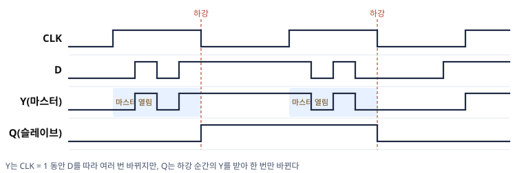

> 📖 **그림은 교재 참고** — Mano 6판 Fig 5.9 (Master–slave D flip-flop)

---

### 3.4 에지 트리거 D 플립플롭 — 에지 순간의 값만 받는 회로

현대의 D 플립플롭은 SR 래치 3개로 구성한 에지 트리거 회로입니다. 오른쪽 출력 래치의 입력 $S$, $R$(활성 로우)을 왼쪽 두 입력 래치가 만듭니다.

> 📖 **그림은 교재 참고** — Mano 6판 Fig 5.10 (D-type positive-edge-triggered flip-flop)

| $Clk$ | 입력 래치의 출력 | 출력 래치 | $Q$ |
|---|---|---|---|
| 0 | $S = R = 1$ ($Clk = 0$이 두 NAND의 출력을 1로 고정) | 유지 입력 (1, 1) | 유지 |
| 0 → 1, $D = 0$ | $R = 0$, $S = 1$ | Reset | 0 |
| 0 → 1, $D = 1$ | $S = 0$, $R = 1$ | Set | 1 |
| 1 유지 중 $D$ 변화 | $S$·$R$ 그대로 | 변화 없음 | 유지 |

- 에지 직후 $S$나 $R$ 가운데 0이 된 신호가 입력 래치로 되돌아가 입력 래치의 상태를 고정합니다. 따라서 $Clk = 1$인 동안 $D$가 바뀌어도 $S$·$R$은 바뀌지 않습니다.
- $Clk$가 0으로 돌아가면 $S = R = 1$이 되어 출력 래치는 다음 상승 에지까지 값을 유지합니다.
- 마스터-슬레이브(3.3절)와 달리 클럭이 1인 동안의 입력 변화가 반영되지 않습니다. 이 회로가 "에지 순간의 값만 받는" 동작을 실제로 구현합니다.

**$Q(t)$와 $Q(t+1)$의 뜻:**

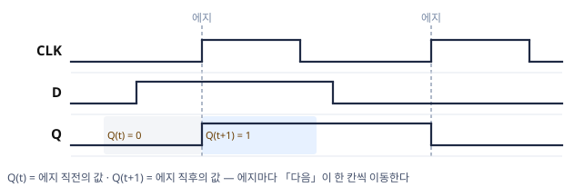

- $Q(t)$는 에지 **직전**의 값, $Q(t+1)$은 에지 **직후**의 값입니다. 에지가 올 때마다 기준 시점 $t$가 한 칸씩 이동합니다.
- 특성방정식 $Q(t+1) = D$는 에지 직전의 입력과 상태로 에지 직후의 상태를 정하는 규칙입니다. 상태표도 같은 뜻으로 읽습니다.

---

### 3.5 D 플립플롭 파형 예제

> ⚠️ **자주 하는 실수** — 파형 문제에서 에지 사이의 $D$ 요동을 $Q$에 반영하는 실수입니다.  
> 에지 트리거 플립플롭의 $Q$는 클럭 에지에서만 갱신됩니다. "에지 시점의 $D$만 읽는다"를 기계적으로 적용합니다.

#### 예제 3-1 — 에지마다 Q 추적

상승 에지 트리거 D 플립플롭에서 각 클럭 에지 시점의 $D$ 값이 다음과 같을 때 $Q$의 변화를 구하라. (초기 $Q = 0$)

| 클럭 에지 | ① | ② | ③ | ④ | ⑤ |
|:---:|:---:|:---:|:---:|:---:|:---:|
| 에지 시점의 $D$ | 1 | 1 | 0 | 1 | 0 |

<details>
<summary>풀이 보기</summary>


에지마다 $Q(t+1) = D$를 적용합니다.

| 클럭 에지 | ① | ② | ③ | ④ | ⑤ |
|:---:|:---:|:---:|:---:|:---:|:---:|
| 에지 시점의 $D$ | 1 | 1 | 0 | 1 | 0 |
| **에지 직후 $Q$** | **1** | 1 | **0** | **1** | **0** |

에지와 에지 사이의 $D$ 변화는 결과에 영향을 주지 않습니다. 플립플롭은 에지 순간의 값만 표본화합니다.

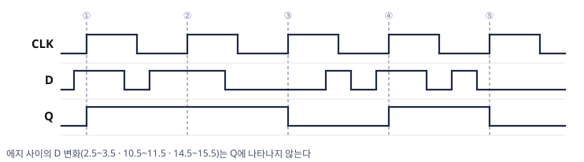

</details>

#### 예제 3-2 — 같은 입력의 래치와 플립플롭

같은 클럭($CLK$)과 같은 $D$ 신호를 D 래치($E = CLK$)와 상승 에지 D 플립플롭에 동시에 인가한다. 각 구간의 $Q$를 두 소자별로 추적하라. (초기 $Q = 0$)

| 구간 | $CLK$ | 구간 시작 시점의 $D$ | 구간 내 $D$ 변화 |
|:---:|:---:|:---:|---|
| ① | 1 | 1 | $1 \to 0$ |
| ② | 0 | 0 | 유지 |
| ③ | 1 | 1 | 유지 |
| ④ | 0 | 1 | $1 \to 0$ |

<details>
<summary>풀이 보기</summary>


래치에는 $CLK = 1$ 동안 $Q = D$를, 플립플롭에는 상승 에지에서만 $Q = D$를 적용합니다.

| 구간 | D 래치 $Q$ | D 플립플롭 $Q$ |
|:---:|---|:---:|
| ① | $1 \to 0$ (투과 — $D$를 따라 요동) | **1** (① 시작 에지에서 $D = 1$ 표본화) |
| ② | 0 유지 | 1 |
| ③ | 1 (다시 따라감) | **1** (③ 시작 에지에서 $D = 1$) |
| ④ | 1 유지 | 1 |

**검산**: 구간 ①에서 두 소자의 출력이 달라집니다. 래치는 $D$의 하강을 통과시켜 $Q$가 0이 되지만, 플립플롭은 에지 순간의 1을 표본화합니다. "레벨은 구간 전체를, 에지는 순간만 반영한다"를 확인할 수 있습니다.

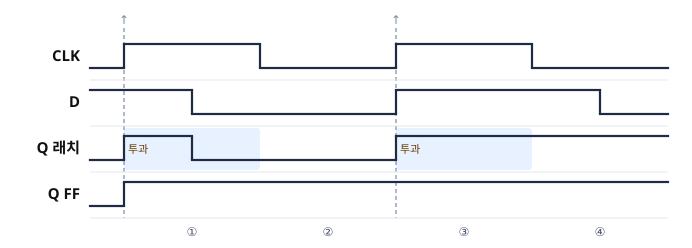

- 구간 ①의 플립플롭 출력은 구간 끝의 $D$가 아니라 구간 **시작** 에지의 $D$로 정해집니다.

</details>

#### 예제 3-3 — 짧은 펄스가 있는 파형 (심화)

아래 파형에서 상승 에지 D 플립플롭의 $Q$를 그려라. (초기 $Q = 0$, 셋업·홀드 조건은 충족)

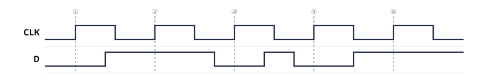

<details>
<summary>풀이 보기</summary>


에지마다 그 순간의 $D$만 읽습니다.

| 에지 | ① | ② | ③ | ④ | ⑤ |
|:---:|:---:|:---:|:---:|:---:|:---:|
| 에지 시점의 $D$ | 0 | 1 | 0 | 0 | 1 |
| 에지 직후 $Q$ | 0 | **1** | **0** | 0 | **1** |

**검산**: ③과 ④ 사이의 짧은 1 펄스는 어느 에지와도 겹치지 않아 $Q$에 나타나지 않습니다. 파형 문제에서 가장 자주 틀리는 지점입니다. $Q$ 파형의 모든 변화점이 CLK 상승 에지와 일치하는지 확인하면 검산이 됩니다.

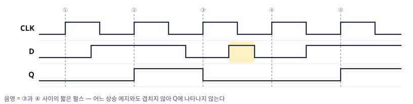

</details>

#### 예제 3-4 — 하강 에지 플립플롭과 셋업 위반 (심화)

예제 3-3과 **같은 CLK·$D$ 파형**을 하강 에지 트리거 D 플립플롭(○▷)에 인가했다. $Q$를 구하고 상승 에지 결과와 비교하라. (초기 $Q = 0$)

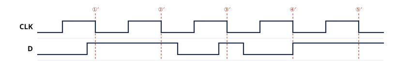

<details>
<summary>풀이 보기</summary>


하강 에지마다 그 순간의 $D$를 읽습니다(셋업 조건 = 3.2절).

| 하강 에지 | ①′ | ②′ | ③′ | ④′ | ⑤′ |
|:---:|:---:|:---:|:---:|:---:|:---:|
| 에지 시점의 $D$ | 1 | 1 | **1** (짧은 펄스) | **전이 중** (0 → 1) | 1 |
| 에지 직후 $Q$ | **1** | 1 | 1 | **불확정** | 1 |

- **③′**: 상승 에지 플립플롭에서 표본화되지 않은 짧은 펄스가 하강 에지 플립플롭에서는 표본화됩니다. 같은 파형이라도 어느 에지를 기준으로 삼느냐에 따라 결과가 다릅니다.
- **④′**: $D$가 에지와 같은 순간 0 → 1로 바뀝니다. **셋업 시간 위반**이며, 실제 소자는 0과 1 가운데 무엇을 저장할지 보장하지 못합니다(메타스테이블). 이러한 그림이 나오면 "셋업 위반 — 값 불확정"이 정답입니다. 회로 설계에서는 $D$가 에지 직전에 안정되도록 배치해야 합니다.
- **①′**: $D$가 에지 한 칸 앞에서 1이 되어 셋업을 만족한 것으로 간주합니다.

**검산**: ①′·②′·⑤′는 $D$가 안정된 1이므로 $Q = 1$입니다. 상승 에지 결과($0, 1, 0, 0, 1$)와 ①·③·④ 세 자리가 다릅니다.

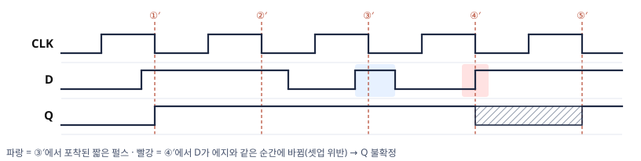

</details>

#### 예제 3-5 — 래치로 착각한 답안 진단 (심화)

예제 3-3과 같은 $CLK$·$D$에 대해 한 학생이 상승 에지 D 플립플롭의 $Q$를 아래처럼 그렸다. 틀린 구간을 모두 찾고, 학생이 어떤 소자로 착각했는지 쓰라.

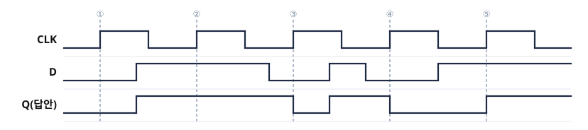

<details>
<summary>풀이 보기</summary>


- 답안의 $Q$는 $t$ = 6과 22에서 상승 에지가 아닌 시점에 바뀌었습니다. 두 시점 모두 $CLK = 1$인 동안 $D$가 바뀐 순간입니다.
- $CLK = 1$ 동안 $D$를 따라가는 것은 D 래치의 동작입니다(2.5절). 학생은 플립플롭을 **레벨 감지 래치로 착각**했습니다.
- 정답 $Q$는 예제 3-3의 풀이와 같습니다. 변화점은 ②·③·⑤ 세 상승 에지뿐입니다.

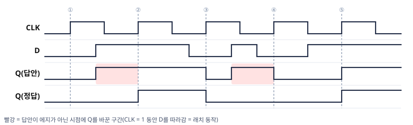

**검산**: 정답의 변화점(11 · 19 · 35)이 모두 상승 에지와 일치합니다.

</details>

#### 예제 3-6 — Q 파형에서 D 복원하기 (심화)

상승 에지 D 플립플롭의 $CLK$와 $Q$가 아래와 같다(초기 $Q = 0$). 이 $Q$를 만들려면 각 에지에서 $D$는 어떤 값이어야 하는가? 값이 정해지지 않는 구간은 ×로 표시하라.

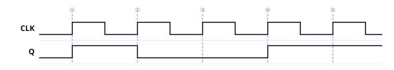

<details>
<summary>풀이 보기</summary>


$Q(t+1) = D$를 역으로 적용하면, 에지 직후의 $Q$가 그 에지의 $D$입니다.

| 에지 | ① | ② | ③ | ④ | ⑤ |
|:---:|:---:|:---:|:---:|:---:|:---:|
| 에지 직후 $Q$ | 1 | 0 | 0 | 1 | 1 |
| 필요한 $D$ | 1 | 0 | 0 | 1 | 1 |

- $D$는 각 에지 전후의 짧은 구간(셋업·홀드)에서만 정해지고, 나머지 구간은 ×입니다.
- ③처럼 $Q$가 바뀌지 않는 에지에서도 $D$는 정해져야 합니다. $D$가 같은 값을 다시 공급해야 $Q$가 유지됩니다.

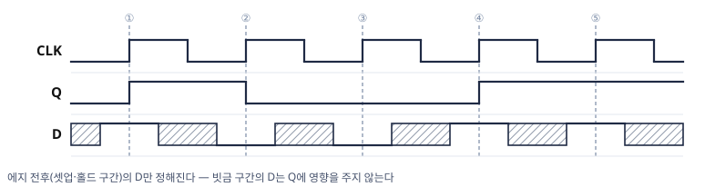

**검산**: 구한 $D$로 에지마다 $Q(t+1) = D$를 적용하면 문제의 $Q$가 그대로 얻어집니다.

</details>

---

### 3.6 플립플롭의 종류와 특성

디지털 시스템에서 가장 많이 사용하는 플립플롭은 **D, JK, T** 세 가지입니다.  
JK와 T 플립플롭은 **D 플립플롭과 외부 논리회로의 조합**으로 구현됩니다.

| 종류 | 가능한 동작 | 특성방정식 | 구현 효율 | 주요 용도 |
|---|---|---|---|---|
| **D 플립플롭** | Set, Reset | $Q(t+1) = D$ | 가장 효율적 (게이트 수 최소) | 레지스터, 메모리 |
| **JK 플립플롭** | Set, Reset, Complement (3가지 모두) | $Q(t+1) = JQ' + K'Q$ | 중간 | 범용 설계 |
| **T 플립플롭** | Complement (토글)만 | $Q(t+1) = T \oplus Q$ | 중간 | 카운터 |

> 💡 **D 플립플롭이 가장 효율적**인 이유:  
> $Q(t+1) = D$로 단순해 외부 로직이 최소화됩니다.  
> 그러나 기능이 제한적이어서 JK, T 플립플롭이 특정 설계에서 더 유리합니다.

---

### 3.7 JK 플립플롭

JK 플립플롭의 동작표:

| $J$ | $K$ | $Q(t+1)$ | 동작 |
|:---:|:---:|:---:|:---:|
| 0 | 0 | $Q(t)$ | **유지** |
| 0 | 1 | 0 | **Reset** |
| 1 | 0 | 1 | **Set** |
| 1 | 1 | $Q'(t)$ | **Complement (토글)** |

> 💡 SR-Latch에서 금지 상태였던 $S=R=1$을 **토글 동작**으로 정의한 것이 JK 플립플롭입니다.

**D 플립플롭으로 구현 시 입력 식:**

$$\boxed{D = JQ' + K'Q}$$

**유도 과정:**

- $J=0, K=0$: $Q(t+1) = Q$ → $D = Q$이어야 함 → $0 \cdot Q' + 1 \cdot Q = Q$ ✓
- $J=0, K=1$: $Q(t+1) = 0$ → $D = 0$ → $0 \cdot Q' + 0 \cdot Q = 0$ ✓
- $J=1, K=0$: $Q(t+1) = 1$ → $D = 1$ → $1 \cdot Q' + 1 \cdot Q = Q'+Q = 1$ ✓
- $J=1, K=1$: $Q(t+1) = Q'$ → $D = Q'$ → $1 \cdot Q' + 0 \cdot Q = Q'$ ✓

**왜 $J = K = 1$이 토글인가 — D 플립플롭으로 만든 JK:**

- D 플립플롭은 $D$를 그대로 다음 상태로 받으므로, 앞단 게이트가 만든 $JQ' + K'Q$가 곧 $Q(t+1)$입니다. 따라서 JK의 특성방정식은 $Q(t+1) = JQ' + K'Q$입니다.
- $J = K = 1$이면 $D = Q'$가 되어 매 에지에서 반전합니다. 이것이 토글의 실체입니다(예제 3-9와 같은 연결).
- $J = K = 0$이면 $D = Q$가 되어 현재 값을 다시 받습니다. 이것이 유지입니다.

> 📖 **그림은 교재 참고** — Mano 6판 Fig 5.12 (JK flip-flop): D 플립플롭과 게이트로 구현한 JK 플립플롭

#### 예제 3-7 — JK 플립플롭 추적

상승 에지 JK 플립플롭(초기 $Q = 0$)에서 에지 시점의 $(J, K)$가 순서대로 $(1,0) \to (0,0) \to (1,1) \to (0,1)$일 때 $Q$를 추적하라.

<details>
<summary>풀이 보기</summary>


에지마다 동작표의 행을 적용합니다.

| 에지 | $(J,K)$ | 동작 | $Q$ |
|:---:|:---:|---|:---:|
| ① | (1,0) | Set | **1** |
| ② | (0,0) | 유지 | 1 |
| ③ | (1,1) | 토글 | **0** |
| ④ | (0,1) | Reset | 0 |

**검산**: 특성방정식으로 ③을 확인합니다(에지 직전 $Q = 1$): $Q(t+1) = JQ' + K'Q = 1 \cdot 0 + 0 \cdot 1 = 0$. 동작표와 방정식의 결과는 같습니다. 둘 중 익숙한 방법을 사용하되, 방정식 계산에서 실수가 적습니다.

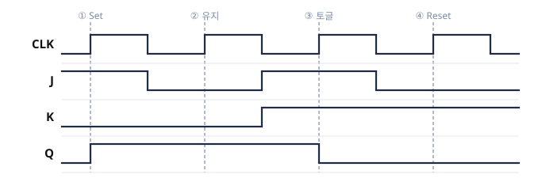

- 토글은 직전 값의 반전이므로 에지 ③에서는 직전 $Q$를 먼저 확인합니다.

</details>

#### 예제 3-8 — 에지 사이의 입력 요동 (심화)

상승 에지 JK 플립플롭(초기 $Q = 0$)에서 에지 시점의 $(J, K)$가 순서대로 ① $(1,1)$ ② $(1,0)$ ③ $(0,0)$ ④ $(0,1)$ ⑤ $(1,1)$이다. $Q$를 추적하고, 에지 **사이**에서 $J$·$K$가 요동해도 무시해야 하는 이유를 함께 답하라.

<details>
<summary>풀이 보기</summary>


| 에지 | ① | ② | ③ | ④ | ⑤ |
|:---:|:---:|:---:|:---:|:---:|:---:|
| $(J,K)$ | (1,1) | (1,0) | (0,0) | (0,1) | (1,1) |
| 동작 | 토글 | Set | 유지 | Reset | 토글 |
| $Q$ | **1** | 1 | 1 | **0** | **1** |

에지 사이의 요동을 무시하는 이유: 에지 트리거 플립플롭은 클럭 에지 순간의 입력만 표본화하기 때문입니다. $D$든 $J, K$든 같은 규칙입니다.

**검산**: ⑤ — $Q(t+1) = JQ' + K'Q = 1 \cdot 1 + 0 \cdot 0 = 1$. 같은 $(1, 1)$이라도 ①과 ⑤의 결과는 직전 값에 따라 정해집니다.

</details>

---

### 3.8 T 플립플롭

T 플립플롭은 **토글(Complement) 동작만** 수행하는 단순한 플립플롭입니다. JK 플립플롭의 $J$와 $K$를 묶으면($J = K = T$) T 플립플롭이 됩니다.

**동작표:**

| $T$ | $Q(t+1)$ | 동작 |
|:---:|:---:|:---:|
| 0 | $Q(t)$ | **유지** |
| 1 | $Q'(t)$ | **토글** |

**D 플립플롭으로 구현 시 입력 식:**

$$\boxed{D = T \oplus Q}$$

**유도:**

- $T=0$: $Q(t+1) = Q$ → $D = Q = 0 \oplus Q$ ✓
- $T=1$: $Q(t+1) = Q'$ → $D = Q' = 1 \oplus Q$ ✓

> 💡 T 플립플롭의 가장 대표적인 응용은 **카운터**입니다.  
> $T = 1$로 고정하면 클럭 에지마다 상태가 토글되어 **주파수 분주기**처럼 동작합니다.

**T 플립플롭의 두 구현:**

- (a) JK 플립플롭의 $J$·$K$를 묶은 구조입니다.
- (b) D 플립플롭 앞에 XOR 게이트를 둔 구조입니다($D = T \oplus Q$). $T = 0$이면 $D = Q$(유지), $T = 1$이면 $D = Q'$(토글)입니다. XOR 게이트는 JK와 같은 방식으로 D 플립플롭의 입력을 구성합니다.

> 📖 **그림은 교재 참고** — Mano 6판 Fig 5.13 (T flip-flop)

#### 예제 3-9 — 자신의 보수를 입력으로 받는 D 플립플롭

D 플립플롭의 입력에 자신의 보수 출력을 연결했다($D = Q'$). 이 회로의 동작을 특성방정식으로 판정하라.

<details>
<summary>풀이 보기</summary>


특성방정식에 대입합니다.

$$Q(t+1) = D = Q'$$

클럭 에지마다 $Q$가 반전합니다. 이것이 **토글 동작**이며, 이 회로는 $T = 1$로 고정한 T 플립플롭과 같습니다.

**검산**: 클럭 에지 4번 동안 $Q$는 $0 \to 1 \to 0 \to 1 \to 0$으로 변합니다. 출력 주파수는 클럭의 **절반**입니다. 이 2분주 동작이 리플 카운터(6장)의 구성 원리입니다.

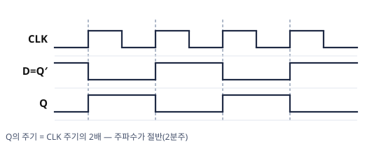

- 같은 연결을 D 래치에 적용한 예제 2-5와 비교합니다. 래치는 $E = 1$ 동안 진동했지만, 플립플롭은 에지마다 한 번만 반전합니다.

</details>

#### 예제 3-10 — Q를 0으로 만드는 입력

현재 $Q = 1$이다. 다음 클럭 에지에서 $Q$를 0으로 만들려면 D·JK·T 플립플롭 각각에 어떤 입력을 주어야 하는가?

<details>
<summary>풀이 보기</summary>


| 플립플롭 | 필요한 입력 | 근거 (특성방정식) |
|:---:|:---:|---|
| D | $D = 0$ | $Q(t+1) = D$ |
| JK | $K = 1$ ($J$는 임의 값 — $J = 1$이면 토글, $J = 0$이면 Reset으로 결과 동일) | $Q(t+1) = JQ' + K'Q = J \cdot 0 + K' \cdot 1 = K'$ |
| T | $T = 1$ | $Q(t+1) = T \oplus 1 = T'$ |

**검산**: JK에서 $J$가 임의 값인 이유 — $Q = 1$일 때 $J$항($JQ'$)은 항상 0이기 때문입니다. "원하는 전이 → 필요한 입력"을 묻는 이 역방향 질문은 순차회로 설계의 **여기표**(5장 2/2)로 정식화됩니다.

</details>

#### 예제 3-11 — JK 플립플롭 두 개를 이은 회로 (심화)

하강 에지 트리거 JK 플립플롭 2개의 $J$·$K$를 모두 1로 고정했다. 첫 번째 플립플롭은 $CLK$를, 두 번째 플립플롭은 첫 번째 플립플롭의 출력 $Q_0$를 클럭으로 받는다(초기 $Q_1Q_0 = 00$). $CLK$ 하강 에지 8번 동안 $Q_0$·$Q_1$을 구하고, $Q_1Q_0$를 2진수로 읽은 값의 변화를 나열하라. (게이트 지연은 무시)

<details>
<summary>풀이 보기</summary>


- $Q_0$: $CLK$ 하강 에지마다 토글합니다($J = K = 1$ → $Q(t+1) = Q'$).
- $Q_1$: $Q_1$의 클럭인 $Q_0$가 1 → 0으로 떨어질 때마다 토글합니다.

| $CLK$ 하강 에지 | 1 | 2 | 3 | 4 | 5 | 6 | 7 | 8 |
|:---:|:---:|:---:|:---:|:---:|:---:|:---:|:---:|:---:|
| $Q_0$ | 1 | 0 | 1 | 0 | 1 | 0 | 1 | 0 |
| $Q_1$ | 0 | 1 | 1 | 0 | 0 | 1 | 1 | 0 |
| $Q_1Q_0$ | 01 | 10 | 11 | 00 | 01 | 10 | 11 | 00 |

**검산**: $Q_1$은 $Q_0$가 떨어지는 에지 2·4·6·8에서만 바뀝니다. 2진수 값이 0 → 1 → 2 → 3 → 0으로 증가하므로 이 회로는 플립플롭 2개로 네 상태를 차례로 거치는 **2비트 카운터**입니다.

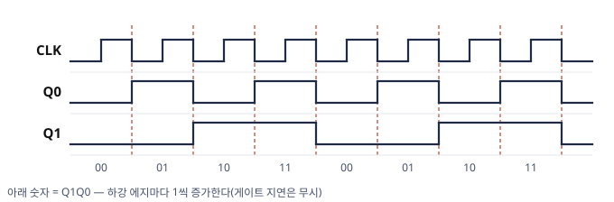

- 출력 $Q_0$를 다음 플립플롭의 클럭으로 사용하는 구조가 **리플 카운터**(6장)입니다. 실제로는 $Q_1$이 첫 플립플롭의 지연만큼 늦게 바뀝니다.

</details>

#### 예제 3-12 — Q 파형에서 T·JK 입력 구하기 (심화)

상승 에지 플립플롭의 $Q$가 아래 파형과 같이 변했다(초기 $Q = 0$). ① 이 변화를 T 플립플롭으로 만들려면 각 에지에서 $T$는 얼마여야 하는가? ② JK 플립플롭으로 만들려면 $J$·$K$는 얼마여야 하는가? 어느 값이어도 되는 입력은 ×로 표기한다.

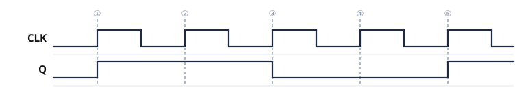

<details>
<summary>풀이 보기</summary>


| 에지 | ① | ② | ③ | ④ | ⑤ |
|:---:|:---:|:---:|:---:|:---:|:---:|
| $Q(t) \to Q(t+1)$ | 0 → 1 | 1 → 1 | 1 → 0 | 0 → 0 | 0 → 1 |
| $T$ | 1 | 0 | 1 | 0 | 1 |
| $J$ | 1 | × | × | 0 | 1 |
| $K$ | × | 0 | 1 | × | × |

- **T** = $Q(t) \oplus Q(t+1)$: 값이 바뀌는 에지에서만 1입니다($Q(t+1) = T \oplus Q$를 $T$에 대해 정리).
- **JK**: $Q(t) = 0$이면 $K'Q = 0$이므로 $Q(t+1) = J$입니다. $J$만 정해지고 $K$는 ×입니다. $Q(t) = 1$이면 $JQ' = 0$이므로 $Q(t+1) = K'$입니다. $K$만 정해지고 $J$는 ×입니다(예제 3-10과 같은 판단).

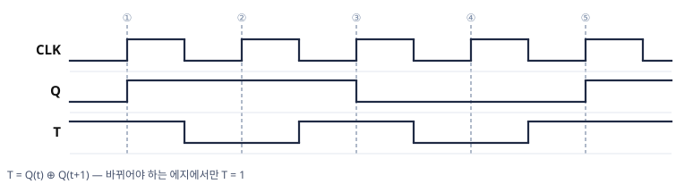

**검산**: 구한 $T$를 $Q(t+1) = T \oplus Q$에 차례로 대입하면 $0 \to 1 \to 1 \to 0 \to 0 \to 1$이 복원됩니다. 이 풀이 표가 순차회로 설계의 **여기표**(5장 2/2)입니다.

- ②·④처럼 $Q$가 바뀌지 않는 에지에서는 $T = 0$입니다.

</details>

---

### 3.9 특성방정식의 유도 — 특성표를 K-map으로

세 특성방정식은 외울 대상이 아니라 **특성표를 K-map(3장)으로 최소화한 결과**입니다. 표만 있으면 언제든 다시 만들 수 있습니다.

#### 예제 3-13 — JK·T 특성방정식 유도

JK 플립플롭의 특성표($J, K, Q(t) \to Q(t+1)$ 8행)를 작성하고, 3변수 K-map으로 특성방정식을 유도하라. T 플립플롭도 같은 절차로 확인하라.

<details>
<summary>풀이 보기</summary>


**JK** — 변수 순서 $J, K, Q$:

| $J$ | $K$ | $Q$ | $Q(t+1)$ | 동작 |
|:---:|:---:|:---:|:---:|---|
| 0 | 0 | 0 | 0 | 유지 |
| 0 | 0 | 1 | 1 | 유지 |
| 0 | 1 | 0 | 0 | Reset |
| 0 | 1 | 1 | 0 | Reset |
| 1 | 0 | 0 | 1 | Set |
| 1 | 0 | 1 | 1 | Set |
| 1 | 1 | 0 | 1 | 토글 |
| 1 | 1 | 1 | 0 | 토글 |

$Q(t+1) = 1$인 행은 $m_1, m_4, m_5, m_6$입니다. 3변수 K-map(행 = $J$ · 열 = $KQ$, 그레이 코드 순서)에 배치합니다.

| $J \backslash KQ$ | 00 | 01 | 11 | 10 |
|:---:|:---:|:---:|:---:|:---:|
| 0 | 0 | **1** ⓑ | 0 | 0 |
| 1 | **1** ⓐ | **1** ⓑ | 0 | **1** ⓐ |

- ⓐ $\{m_4, m_6\}$ = $J = 1, Q = 0$ → $JQ'$ (양 끝 열은 한 비트만 다르므로 인접)
- ⓑ $\{m_1, m_5\}$ = $K = 0, Q = 1$ → $K'Q$

$$Q(t+1) = JQ' + K'Q$$

**T** — 변수 $T, Q$:

| $T \backslash Q$ | 0 | 1 |
|:---:|:---:|:---:|
| 0 | 0 | **1** |
| 1 | **1** | 0 |

- 1이 대각선에 놓여 인접 묶음이 없습니다(체커보드). $T'Q + TQ' = T \oplus Q$입니다.

**검산**: JK 행 $(1,1,1)$: $JQ' + K'Q = 0 + 0 = 0$ (토글 $1 \to 0$) / T 행 $(1,1)$: $1 \oplus 1 = 0$

> 💡 D는 $Q(t+1) = D$가 되도록 표를 정의했으므로 유도가 필요하지 않습니다. 특성방정식을 기억하지 못하면 **특성표 → K-map**으로 복원할 수 있습니다.

</details>

---

### 3.10 비동기 직접입력 (Preset / Clear)

일부 플립플롭에는 **클럭과 무관하게 즉시 상태를 강제 설정**하는 비동기 입력이 있습니다.

| 입력 | 동작 |
|---|---|
| **Preset** | $Q$를 **1**로 강제 설정 (클럭 무관) |
| **Clear (Reset)** | $Q$를 **0**으로 강제 설정 (클럭 무관) |

**사용 이유**: 디지털 시스템에 전원이 처음 인가될 때, 플립플롭의 초기 상태를 알 수 없습니다.  
Clear 입력으로 모든 플립플롭을 0으로 초기화한 뒤 정상 동작을 시작합니다.

> ⚠️ 비동기 직접입력은 **클럭과 독립**적으로 동작하므로,  
> 정상 동작 중에는 사용하지 않는 것이 원칙입니다.

- 직접 입력은 대개 **활성 로우**(0일 때 동작)이며, 기호에서는 입력에 작은 원(버블)으로 표시합니다. 정상 동작 중에는 비활성(1)으로 둡니다.

> 📖 **그림은 교재 참고** — Mano 6판 Fig 5.14 (D flip-flop with asynchronous reset)

---

### 3.11 플립플롭 그래픽 기호 정리

회로도와 Logisim에서 소자를 읽을 때 필요한 표시는 세 가지입니다 — **삼각형**(에지), **버블**(활성 로우·하강), **직접 입력 핀**.

| 소자 | 클럭 입력 표시 | 데이터 입력 | 비고 |
|---|---|---|---|
| SR 래치 | 삼각형 없음 (제어 입력이 있으면 $E$) | $S$, $R$ (NAND형은 버블 — $S'$, $R'$) | 레벨 감지 · 금지 입력 있음 |
| D 래치 | 삼각형 없음 ($E$ 또는 $C$) | $D$ | 레벨 감지 |
| D 플립플롭 (상승 에지) | ▷ 삼각형 | $D$ | 표준 저장 요소 |
| D 플립플롭 (하강 에지) | ○▷ 버블 + 삼각형 | $D$ | 클럭 반전 |
| JK 플립플롭 | ▷ | $J$, $K$ | 토글 가능 |
| T 플립플롭 | ▷ | $T$ | 카운터용 |
| 직접 입력 | — | $\overline{PRE}$, $\overline{CLR}$ (버블) | 클럭 무관 · 활성 로우 |

**읽는 순서**: ① 삼각형이 있는가(래치 vs 플립플롭) → ② 버블이 있는가(상승 vs 하강) → ③ 데이터 입력 이름(D·JK·T) → ④ 직접 입력 핀의 현재 값(비활성 1인가). 파형 문제에서는 대개 ①·②만 그림으로 제시됩니다.

> 📖 **그림은 교재 참고** — Mano 6판 Fig 5.7 (Graphic symbols for latches) · Fig 5.11 (Graphic symbol for edge-triggered D flip-flop)

---

### 3.12 복습문제

#### 문제 (1)

JK 플립플롭의 현재 상태가 $Q = 1$이고, 입력이 $J = 1$, $K = 0$이다.  
다음 클럭 에지 이후 $Q(t+1)$은?

<details>
<summary>정답 및 풀이 보기</summary>


$J = 1$, $K = 0$ → **Set 동작** → $Q(t+1) = 1$

D 플립플롭 입력 식으로 검증:

$$D = JQ' + K'Q = 1 \cdot 0 + 1 \cdot 1 = 0 + 1 = 1$$

$$\boxed{Q(t+1) = 1}$$

</details>

---

#### 문제 (2)

T 플립플롭의 현재 상태가 $Q = 0$이고, 입력 $T = 1$이다.  
다음 클럭 에지 이후 $Q(t+1)$은?

<details>
<summary>정답 및 풀이 보기</summary>


$T = 1$ → **토글 동작** → $Q(t+1) = Q' = 1$

입력 식으로 검증:

$$D = T \oplus Q = 1 \oplus 0 = 1$$

$$\boxed{Q(t+1) = 1}$$

</details>

---

#### 문제 (3)

JK 플립플롭의 특성방정식 $Q(t+1) = JQ' + K'Q$에 $J = K = 1$을 대입해 토글 동작을 확인하라.

<details>
<summary>정답 및 풀이 보기</summary>


$$Q(t+1) = 1 \cdot Q' + 0 \cdot Q = Q'$$

($K = 1$이므로 $K' = 0$.) 다음 상태가 항상 현재 상태의 반전이므로 **토글**이 확인됩니다.

</details>

---

#### 문제 (4)

T 플립플롭에 $T = 1$을 고정하고 클럭을 4번 가할 때 $Q$의 순서를 나열하라. (초기 $Q = 0$) 이 동작을 "주파수" 관점에서 한 줄로 해석하라.

<details>
<summary>정답 및 풀이 보기</summary>


$$Q: 0 \to 1 \to 0 \to 1 \to 0$$

클럭 4주기 동안 $Q$는 2주기를 거칩니다. 즉 **출력 주파수는 클럭의 1/2**입니다. T 플립플롭을 $n$단 이으면 $1/2^n$이 되며, 이것이 리플 카운터의 원리입니다.

</details>

---

#### 문제 (5)

상승 에지 트리거 D 플립플롭에서 에지 시점의 $D$ 값이 순서대로 $0, 1, 1, 0$일 때 $Q$의 변화를 구하라. (초기 $Q = 1$)

<details>
<summary>정답 및 풀이 보기</summary>


$Q(t+1) = D$를 에지마다 적용합니다.

| 에지 | ① | ② | ③ | ④ |
|:---:|:---:|:---:|:---:|:---:|
| $D$ | 0 | 1 | 1 | 0 |
| $Q$ | **0** | **1** | 1 | **0** |

초기값 1은 첫 에지에서 $D = 0$으로 덮어써집니다. 플립플롭에 저장된 이전 값은 에지 한 번으로 바뀝니다.

</details>

---

#### 문제 (6)

JK 플립플롭 1개와 인버터 1개로 **D 플립플롭과 동일하게** 동작하는 회로를 만들려 한다. $J$·$K$에 무엇을 연결해야 하는지 서술하고, 특성방정식으로 확인하라.

<details>
<summary>정답 및 풀이 보기</summary>


$$J = D, \qquad K = D' \quad (\text{인버터 1개})$$

특성방정식으로 확인합니다.

$$Q(t+1) = JQ' + K'Q = DQ' + DQ = D(Q' + Q) = D$$

$J = K$로 묶어 T 플립플롭으로 변환하는 것(3.8절)과 함께 보면, 플립플롭의 종류는 배선(조합논리)으로 **상호 변환할 수 있습니다**. 순차회로 설계에서 "어떤 플립플롭을 사용할 것인가"를 자유롭게 선택할 수 있는 이유입니다.

</details>

---

#### 문제 (7)

활성 로우 클리어 입력 $\overline{CLR}$이 있는 상승 에지 D 플립플롭(현재 $Q = 1$, $D = 1$ 고정)에서 다음 순서로 신호가 변할 때 각 단계의 $Q$를 답하라: ① $\overline{CLR}$을 0으로 내림(클럭 에지 없음) ② $\overline{CLR}$을 1로 복귀 ③ 상승 에지 도착

<details>
<summary>정답 및 풀이 보기</summary>


- ① $Q = 0$ — 클럭과 무관하게 **즉시** 0이 됩니다(비동기).
- ② $Q = 0$ 유지 — 클리어를 해제해도 에지가 없으면 값은 변하지 않습니다.
- ③ $Q = D = 1$ — 정상 동기 동작으로 복귀합니다.

**검산**: ①에서 $D = 1$이어도 $Q$가 0이 되는 현상이 "직접 입력은 클럭·$D$보다 우선"의 뜻입니다. 전원 투입 직후 모든 플립플롭을 ①로 초기화한 뒤 ②③처럼 동작시키는 것이 순차회로의 시작 절차입니다.

</details>

---

---

## 4. 클럭형 순차회로 해석

### 학습목표

- 클럭형 순차회로에서 상태방정식을 도출할 수 있다.
- 상태방정식으로부터 상태표와 상태천이도를 작성할 수 있다.
- D, JK, T 플립플롭 각각에 대한 해석 예제를 수행할 수 있다.

---

### 4.1 해석 절차 (4단계)

**회로도 → 관계식 → 상태표 → 상태천이도**

| 단계 | 내용 |
|---|---|
| **Step 1** | 회로에서 플립플롭의 **입력 식**($D$, $JK$, $T$)을 도출 |
| **Step 2** | 플립플롭 특성 방정식을 이용해 **다음 상태 식** $Q(t+1)$ 도출 |
| **Step 3** | 모든 현재 상태와 입력 조합에 대해 **상태표** 작성 |
| **Step 4** | 상태표를 시각화하여 **상태천이도** 작성 |

> 💡 **핵심**: 조합논리 해석이 "입력 → 게이트 → 출력"을 추적하는 것처럼,  
> 순차회로 해석은 "현재 상태 + 입력 → 다음 상태 + 출력"을 시간 순서로 추적합니다.

---

### 4.2 상태표와 상태천이도 형식

**상태표(State Table) 형식:**

| 현재 상태 | 입력 | 다음 상태 | 출력 |
|:---:|:---:|:---:|:---:|
| $AB$ | $x$ | $A(t+1)B(t+1)$ | $y$ |

**상태천이도(State Diagram) 형식:**

```
        x=0/y=0
  ┌──────────────┐
  │              │
  ▼    x=1/y=0  │
[상태 S0] ────▶ [상태 S1]
  ▲              │
  └──────────────┘
        x=0/y=1
```

화살표 위의 표기:  
$$\text{입력} / \text{출력}$$

---

### 4.3 예제 1 — D 플립플롭 해석

> **조건**: 플립플롭 A, B / 입력 x / 출력 y  
> 회로에서 도출된 플립플롭 입력 식:

$$D_A = Ax + Bx$$
$$D_B = A'x$$
$$y = (A+B)x'$$

**Step 2** — D 플립플롭 특성 방정식 $Q(t+1) = D$ 적용:

$$A(t+1) = Ax + Bx$$
$$B(t+1) = A'x$$
$$y = (A+B)x'$$

**Step 3** — 상태표 작성:

| 현재 $AB$ | $x$ | $A(t+1)$ | $B(t+1)$ | $y$ |
|:---:|:---:|:---:|:---:|:---:|
| 00 | 0 | 0 | 0 | 0 |
| 00 | 1 | 0 | 1 | 0 |
| 01 | 0 | 0 | 0 | 1 |
| 01 | 1 | 1 | 0 | 0 |
| 10 | 0 | 0 | 0 | 1 |
| 10 | 1 | 1 | 0 | 0 |
| 11 | 0 | 0 | 0 | 1 |
| 11 | 1 | 1 | 0 | 0 |

**행별 계산 확인 (예: $AB=01$, $x=1$):**

$$A(t+1) = Ax + Bx = 0 \cdot 1 + 1 \cdot 1 = 0 + 1 = 1$$
$$B(t+1) = A'x = 1 \cdot 1 = 1 \quad \rightarrow \text{※슬라이드 식 재확인}$$

> ⚠️ 슬라이드에서 $B(t+1) = A'x$로 제시됩니다.  
> $AB = 01$, $x = 1$에서: $A' = 1$, $x = 1$ → $B(t+1) = 1$  
> 따라서 다음 상태는 $AB = 11$이 됩니다.  
> 진리표 작성 시 각 행마다 이렇게 직접 대입해야 합니다.

**Step 4** — 상태천이도:

```
               x=0/y=0
         ┌─────────────────┐
         │                 ▼
[AB=00] ─── x=1/y=0 ──▶ [AB=01]
                             │
                          x=1/y=0
                             │
                             ▼
[AB=11] ◀── x=1/y=0 ── [AB=10]
   │                         ▲
   └────── x=0/y=1 ──────────┘
```

---

### 4.4 예제 2 — JK 플립플롭 해석

> **조건**: 플립플롭 A, B / 입력 x  
> 회로에서 도출된 JK 입력 식:

$$J_A = B, \quad K_A = Bx'$$
$$J_B = x', \quad K_B = A'x + Ax'$$

**Step 2** — JK 특성 방정식 $D = JQ' + K'Q$ 적용:

$$A(t+1) = J_A A' + K_A' A = BA' + (Bx')'A$$
$$= A'B + (B' + x)A = A'B + AB' + Ax$$

$$B(t+1) = J_B B' + K_B' B = x'B' + (A'x + Ax')'B$$
$$= x'B' + (Ax + A'x')B = x'B' + ABx + A'Bx'$$

**Step 3** — 상태표:

| 현재 $AB$ | $x$ | $A(t+1)$ | $B(t+1)$ |
|:---:|:---:|:---:|:---:|
| 00 | 0 | 0 | 1 |
| 00 | 1 | 0 | 0 |
| 01 | 0 | 1 | 0 |
| 01 | 1 | 1 | 1 |
| 10 | 0 | 0 | 1 |
| 10 | 1 | 1 | 0 |
| 11 | 0 | 1 | 0 |
| 11 | 1 | 1 | 1 |

> 💡 **계산 확인 예시** ($AB=01$, $x=0$):
>
> $$A(t+1) = A'B + AB' + Ax = 1 \cdot 1 + 0 \cdot 0 + 0 \cdot 0 = 1$$
> $$B(t+1) = x'B' + ABx + A'Bx' = 1 \cdot 0 + 0 + 1 \cdot 1 \cdot 1 = 1$$
>
> 따라서 다음 상태 = $AB = 11$

---

### 4.5 예제 3 — T 플립플롭 해석

> **조건**: 플립플롭 A, B / 입력 x / 출력 y  
> 회로에서 도출된 T 입력 식:

$$T_A = Bx, \quad T_B = x, \quad y = AB$$

**Step 2** — T 특성 방정식 $Q(t+1) = T \oplus Q$ 적용:

$$A(t+1) = T_A \oplus A = (Bx) \oplus A$$
$$= (Bx)'A + (Bx)A' = (B'+x')A + BxA' = AB' + Ax' + A'Bx$$

$$B(t+1) = T_B \oplus B = x \oplus B = xB' + x'B$$

$$y = AB$$

**Step 3** — 상태표:

| 현재 $AB$ | $x$ | $A(t+1)$ | $B(t+1)$ | $y$ |
|:---:|:---:|:---:|:---:|:---:|
| 00 | 0 | 0 | 0 | 0 |
| 00 | 1 | 0 | 1 | 0 |
| 01 | 0 | 0 | 1 | 0 |
| 01 | 1 | 1 | 0 | 0 |
| 10 | 0 | 1 | 0 | 0 |
| 10 | 1 | 1 | 1 | 0 |
| 11 | 0 | 1 | 1 | 1 |
| 11 | 1 | 0 | 0 | 1 |

> 💡 **계산 확인 예시** ($AB=11$, $x=1$):
>
> $$A(t+1) = AB' + Ax' + A'Bx = 1 \cdot 0 + 1 \cdot 0 + 0 = 0$$
> $$B(t+1) = xB' + x'B = 1 \cdot 0 + 0 \cdot 1 = 0$$
> $$y = AB = 1 \cdot 1 = 1$$
>
> 다음 상태 = $AB = 00$, 출력 $y = 1$

---

### 4.6 복습문제

#### 문제 (1)

다음 다음 상태 식을 가진 D 플립플롭 기반 순차회로의 상태표를 작성하라.

$$A(t+1) = Ax + A'x'$$
$$B(t+1) = Bx + B'x'$$
$$y = A \oplus B$$

<details>
<summary>정답 및 풀이 보기</summary>


| 현재 $AB$ | $x$ | $A(t+1)$ | $B(t+1)$ | $y$ |
|:---:|:---:|:---:|:---:|:---:|
| 00 | 0 | 1 | 1 | 0 |
| 00 | 1 | 0 | 0 | 0 |
| 01 | 0 | 1 | 0 | 1 |
| 01 | 1 | 0 | 1 | 1 |
| 10 | 0 | 0 | 1 | 1 |
| 10 | 1 | 1 | 0 | 1 |
| 11 | 0 | 0 | 0 | 0 |
| 11 | 1 | 1 | 1 | 0 |

**계산 예시** ($AB=01$, $x=0$):
$$A(t+1) = 0 \cdot 0 + 1 \cdot 1 = 1$$
$$B(t+1) = 1 \cdot 0 + 0 \cdot 1 = 0$$
$$y = 0 \oplus 1 = 1$$

</details>

---

#### 문제 (2)

JK 플립플롭의 특성 방정식 $D = JQ' + K'Q$를 이용하여  
$J = 1$, $K = 1$, 현재 $Q = 1$일 때 다음 상태를 계산하라.

<details>
<summary>정답 보기</summary>


$$D = JQ' + K'Q = 1 \cdot 0 + 0 \cdot 1 = 0$$

$$\boxed{Q(t+1) = 0} \quad \text{(토글: 1 → 0)}$$

</details>

---

> 📌 **2차 보조자료 예고**  
> 다음 자료(2/2)에서는 아래 내용을 다룹니다.
> - 5. 유한상태머신 (Moore / Mealy Machine, 글리치)
> - 6. 순차회로 설계 절차 (상태도 → 상태축소 → 상태할당 → 논리식 → 회로)
> - 7. 설계 예제 (D 플립플롭: 연속 1 검출기 / JK 플립플롭 / T 플립플롭: 3비트 카운터)
> - 8. 연습문제 해설 (5.11 상태축소 검증 / 5.16 순환 카운터 설계)
