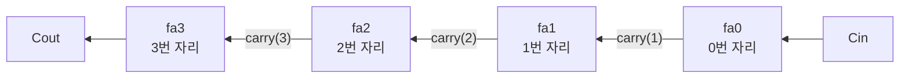

# 교재 회로로 배우는 HDL — Mano 6판 장별 VHDL 예제
### HDL 개요 · 3장 게이트 레벨 최소화 · 4장 조합논리

> 이 자료는 교재(Mano & Ciletti, *Digital Design* 6판) 각 장의 회로를 VHDL로 기술하고 읽는 방법을 정리한 보조학습자료입니다.  
> 모든 코드에는 줄 단위로 주석을 달았습니다. 구문 설명은 **그 절에서 처음 등장하는 내용만** 싣습니다. 앞 절에서 설명한 구문은 문서 끝의 [구문 색인](#구문-색인)에서 찾을 수 있습니다.  
> 교재의 장 순서에 따라 내용을 순차적으로 추가합니다.

---

## 목차

- [0. HDL 개요](#0-hdl-개요)
  - [0-1. HDL이란](#0-1-hdl이란)
  - [0-2. VHDL과 Verilog](#0-2-vhdl과-verilog)
  - [0-3. 시뮬레이션과 합성](#0-3-시뮬레이션과-합성)
  - [0-4. Design과 Testbench](#0-4-design과-testbench)
  - [0-5. 실행 환경](#0-5-실행-환경)
- [3장. 게이트 레벨 최소화](#3장-게이트-레벨-최소화)
  - [3-1. 대상 회로](#3-1-대상-회로)
  - [3-2. 최소식을 기술하는 Design](#3-2-최소식을-기술하는-design)
  - [3-3. 진리표를 인가하는 Testbench](#3-3-진리표를-인가하는-testbench)
  - [3-4. 실행 결과 확인](#3-4-실행-결과-확인)
  - [3-5. 게이트 단위 기술](#3-5-게이트-단위-기술)
  - [3-6. 더 알아보기](#3-6-더-알아보기)
- [4장. 조합논리](#4장-조합논리)
  - [4-1. 대상 회로](#4-1-대상-회로)
  - [4-2. 전가산기 Design](#4-2-전가산기-design)
  - [4-3. 전가산기 Testbench](#4-3-전가산기-testbench)
  - [4-4. 실행 결과 확인](#4-4-실행-결과-확인)
  - [4-5. 전가산기를 연결한 4비트 가산기](#4-5-전가산기를-연결한-4비트-가산기)
  - [4-6. 더 알아보기](#4-6-더-알아보기)
- [구문 색인](#구문-색인)

---

## 0. HDL 개요

### 학습목표

- HDL이 회로를 어떤 방식으로 표현하는지 설명할 수 있다.
- 시뮬레이션과 합성의 차이를 구분할 수 있다.
- Design과 Testbench의 역할을 구분할 수 있다.

---

### 0-1. HDL이란

**HDL(Hardware Description Language, 하드웨어 기술 언어)** 은 회로의 구조와 동작을 텍스트로 기술하는 언어입니다. 겉모습은 프로그래밍 언어와 비슷하지만, 결과물은 CPU(Central Processing Unit, 중앙처리장치)가 실행하는 명령이 아니라 **게이트와 플립플롭으로 이루어진 회로**입니다.

교재에서 회로는 진리표·부울식·회로도로 표현됩니다. HDL은 같은 정보를 텍스트로 기록하는 또 하나의 표현 방식입니다.

| 표현 방식 | 적합한 규모 | 특징 |
|------|------|------|
| 진리표 | 입력 수 개 | 입력 조합 전체를 나열 · 입력이 하나 늘 때마다 행이 2배로 증가 |
| 부울식 | 소규모 | 간소화와 대수 조작에 적합 |
| 회로도 | 소·중규모 | 구조가 시각적으로 드러남 · 대규모에서는 작성과 수정이 어려움 |
| HDL | 소규모부터 대규모까지 | 복사·수정·버전 관리 가능 · 자동 검증과 자동 회로 변환 가능 |

오늘날 FPGA(Field-Programmable Gate Array)와 ASIC(Application-Specific Integrated Circuit, 주문형 반도체)의 설계는 주로 HDL로 기술합니다.

---

### 0-2. VHDL과 Verilog

널리 사용되는 HDL은 VHDL과 Verilog 두 가지입니다. 이 자료는 **VHDL**로 기술합니다.

| 항목 | VHDL | Verilog |
|------|------|------|
| 이름 | VHSIC Hardware Description Language (VHSIC = Very High Speed Integrated Circuit) | — |
| 표준 | IEEE 1076 (1987년 최초 제정) | IEEE 1364 (1995년 최초 제정) |
| 출발 | 미국 국방부 VHSIC 프로그램 | 민간 기업의 시뮬레이션 언어 |
| 문법 성격 | 자료형 검사가 엄격 · 기술량이 많음 | C 언어와 유사한 문법 · 간결 |
| 후속 개정·확장 | VHDL-2008 등 개정 | SystemVerilog(IEEE 1800)로 확장 |

IEEE는 Institute of Electrical and Electronics Engineers(미국 전기전자공학회)의 약어입니다. 두 언어는 기술 방식이 다를 뿐 표현하려는 대상은 같으므로, 한 언어로 회로를 읽을 수 있으면 다른 언어로도 어렵지 않게 전환할 수 있습니다.

---

### 0-3. 시뮬레이션과 합성

HDL 코드는 두 가지 목적으로 처리됩니다.

| 처리 | 하는 일 | 결과 |
|------|------|------|
| **시뮬레이션** | 기술한 회로에 입력을 인가하고 시간에 따른 출력을 계산 | 파형 — 설계한 동작과 일치하는지 확인 |
| **합성**(synthesis) | 코드를 실제 게이트·플립플롭의 연결 구조로 변환 | 넷리스트(netlist) — FPGA·ASIC 구현의 입력 |

회로 시뮬레이터에서 입력 스위치를 바꾸며 출력을 확인하는 작업이 HDL의 시뮬레이션에 해당합니다.

> [!NOTE]
> 모든 문장이 합성되는 것은 아닙니다. 시간을 지정하는 `wait for 10 ns;` 같은 문장은 **시뮬레이션 전용**이며, 실제 회로로 변환되지 않습니다.

---

### 0-4. Design과 Testbench

HDL로 회로를 검증할 때는 코드를 두 부분으로 나누어 작성합니다.

| 구분 | Design | Testbench |
|------|------|------|
| 무엇인가 | **만들려는 회로 자체** | 그 회로를 **시험하는 장치** |
| 하드웨어로 구현 | 됨 — 합성 대상 | 되지 않음 — 시뮬레이션 전용 |
| 외부 핀 | 있음 | 없음 — 필요한 신호를 내부에서 생성 |
| 시간 지정 | 하지 않음 | 입력을 인가할 시점을 직접 지정 |


회로 시뮬레이터에 빗대면 Design은 설계자가 그린 회로도이고, Testbench는 입력 스위치를 정해진 순서대로 바꾸는 동작을 코드로 기록한 것입니다.

---

### 0-5. 실행 환경

이 자료의 코드는 **VHDL을 지원하는 시뮬레이터라면 어느 것에서든** 실행할 수 있습니다. 무료 시뮬레이터, 웹 실행 환경, FPGA 제조사의 개발 도구가 모두 해당하며, 특정 도구의 사용 절차는 다루지 않습니다.

도구와 관계없이 실행 절차는 같습니다.

1. Design 코드와 Testbench 코드를 각각 입력합니다(파일 두 개 또는 입력 창 두 개).
2. 시뮬레이션의 최상위 단위(top)를 **테스트벤치의 entity 이름**으로 지정합니다.
3. 실행한 뒤 파형 창에서 입력·출력 신호를 확인합니다.

> [!WARNING]
> 코드의 주석에는 한글이 포함되어 있습니다. 일부 도구는 주석의 다바이트 문자(한글 등)를 오류로 처리합니다. 오류가 발생하면 도구의 다바이트 주석 허용 설정을 켜거나, 주석을 삭제한 뒤 실행합니다.

---

## 3장. 게이트 레벨 최소화

교재 3장은 카르노 맵(K-map, Karnaugh map)으로 부울 함수를 최소화하고, 그 결과를 NAND·NOR 게이트로 구현하는 방법을 다룹니다. 이 절에서는 최소화한 식을 VHDL로 기술하고, 테스트벤치로 진리표 전체를 검증합니다.

### 학습목표

- K-map으로 얻은 최소식을 VHDL 문장으로 기술하고, 식과 코드의 대응을 읽을 수 있다.
- 테스트벤치가 진리표의 입력 조합을 차례로 인가하는 구조를 설명할 수 있다.
- 같은 회로를 식 단위 기술과 게이트 단위 기술로 비교할 수 있다.

---

### 3-1. 대상 회로

3변수 함수 $F(x, y, z) = \Sigma m(1, 3, 6, 7)$을 K-map으로 최소화한 결과는 다음과 같습니다.

$$F = x'z + xy$$

- $m_1, m_3$ 묶음 → $x'z$
- $m_6, m_7$ 묶음 → $xy$

| 민텀 | $x$ | $y$ | $z$ | $F$ |
|:--:|:--:|:--:|:--:|:--:|
| $m_0$ | 0 | 0 | 0 | 0 |
| $m_1$ | 0 | 0 | 1 | **1** |
| $m_2$ | 0 | 1 | 0 | 0 |
| $m_3$ | 0 | 1 | 1 | **1** |
| $m_4$ | 1 | 0 | 0 | 0 |
| $m_5$ | 1 | 0 | 1 | 0 |
| $m_6$ | 1 | 1 | 0 | **1** |
| $m_7$ | 1 | 1 | 1 | **1** |

---

### 3-2. 최소식을 기술하는 Design

```vhdl
-- ============================================================
--  kmap_demo : F(x, y, z) = Σm(1, 3, 6, 7) 의 최소식 F = x'z + xy
-- ============================================================

-- [1] 라이브러리 선언 : 거의 모든 VHDL 파일이 이 두 줄로 시작합니다
library ieee;                          -- IEEE 표준 라이브러리를 사용하겠다고 선언합니다
use ieee.std_logic_1164.all;           -- 그 안의 std_logic 자료형과 논리 연산을 모두 불러옵니다

-- [2] entity : 회로의 외형, 즉 바깥으로 드러나는 핀 목록을 정의합니다
entity kmap_demo is
  port (
    x, y, z : in  std_logic;           -- 입력 핀 3개 (형식 = 이름 : 방향 자료형)
    F       : out std_logic            -- 출력 핀 1개 (마지막 항목 뒤에는 세미콜론을 붙이지 않습니다)
  );
end kmap_demo;                         -- entity를 닫을 때 이름을 한 번 더 적습니다

-- [3] architecture : 회로 내부의 동작을 기술합니다
--     dataflow     = 이 기술에 붙인 이름 (설계자가 정합니다)
--     of kmap_demo = 어느 entity의 내부인지를 가리킵니다
architecture dataflow of kmap_demo is
begin
  -- 최소식 F = x'z + xy 를 그대로 기술한 한 줄입니다
  --   보수 x'      -> (not x)
  --   곱(AND)      -> and
  --   합(OR)       -> or
  --   곱 항마다 괄호로 묶습니다 (이유는 3-6 「연산자 우선순위와 괄호」에서 설명합니다)
  F <= ((not x) and z) or (x and y);   -- 입력 x, y, z 중 하나라도 바뀌면 F가 다시 계산됩니다
end dataflow;                          -- architecture를 닫을 때도 이름을 적습니다
```

**처음 등장하는 구문**

| 구문 | 의미 |
|------|------|
| `--` | 주석 — 그 줄의 끝까지 실행에서 제외 |
| `;` | 문장의 끝 |
| `library ieee;` | IEEE 표준 라이브러리 사용 선언 |
| `use ieee.std_logic_1164.all;` | 라이브러리 안의 `std_logic_1164` 패키지에 정의된 자료형·연산을 모두 불러옴 |
| `entity 이름 is … end 이름;` | 회로의 외형 — 바깥으로 드러나는 핀 목록 |
| `port ( … );` | 핀 목록 — `이름 : 방향 자료형` 형식 · 항목 사이는 `;`로 구분 |
| `in` · `out` | 핀 방향 — 입력 · 출력 |
| `std_logic` | 1비트 논리값 자료형 — 회로에서는 주로 `'0'`·`'1'` 사용 |
| `architecture 이름 of entity이름 is … begin … end 이름;` | 회로 내부의 동작 |
| `<=` | 신호 대입 — 오른쪽 식의 값을 왼쪽 신호로 내보냄 · 입력이 변할 때마다 다시 계산 |
| `not` · `and` · `or` | 논리 연산 — NOT · AND · OR 게이트에 대응 |

> [!TIP]
> `<=`는 프로그래밍 언어의 대입(한 번 계산해 저장)과 다릅니다. 회로의 **배선**에 해당하므로, 입력이 바뀌면 출력도 항상 함께 변합니다.

---

### 3-3. 진리표를 인가하는 Testbench

```vhdl
-- ============================================================
--  tb_kmap_demo : kmap_demo에 진리표 8행을 차례로 인가하는 테스트벤치
-- ============================================================

library ieee;                          -- Design과 같은 라이브러리를 선언합니다
use ieee.std_logic_1164.all;

-- [1] 테스트벤치 entity : 외부와 연결할 핀이 없으므로 port를 두지 않습니다
entity tb_kmap_demo is
end tb_kmap_demo;

architecture sim of tb_kmap_demo is
  -- [2] is 와 begin 사이(선언부) : 내부에서 사용할 신호를 선언합니다
  --     신호 = 회로도의 선입니다. 이름을 Design의 핀 이름과 같게 두면 연결을 읽기 쉽습니다
  signal x, y, z : std_logic;          -- 테스트벤치가 값을 만들어 시험 대상에 넣을 입력 신호
  signal F       : std_logic;          -- 시험 대상이 내보낸 값을 받을 출력 신호
begin
  -- [3] 시험 대상 배치
  --     uut  = 이 문장에 붙인 레이블 (unit under test, 시험 대상 회로)
  --     entity work.kmap_demo = 작업 라이브러리(work)에 있는 kmap_demo를 하나 배치합니다
  uut: entity work.kmap_demo
    port map (
      x => x,                          -- 왼쪽 = Design의 핀 이름,  오른쪽 = 이 테스트벤치의 신호 이름
      y => y,
      z => z,
      F => F                           -- 출력 핀 F를 신호 F에 연결해 결과를 받습니다
    );

  -- [4] 입력 시나리오
  --     process 안의 문장은 위에서 아래로 차례대로 실행됩니다
  --     한 줄에 x, y, z 값을 정한 뒤 10 ns를 기다리므로, 파형에는 10 ns 폭의 구간이 8개 생깁니다
  stim: process
  begin
    x <= '0'; y <= '0'; z <= '0'; wait for 10 ns;  -- m0 (000) : F = 0 이어야 합니다
    x <= '0'; y <= '0'; z <= '1'; wait for 10 ns;  -- m1 (001) : F = 1
    x <= '0'; y <= '1'; z <= '0'; wait for 10 ns;  -- m2 (010) : F = 0
    x <= '0'; y <= '1'; z <= '1'; wait for 10 ns;  -- m3 (011) : F = 1
    x <= '1'; y <= '0'; z <= '0'; wait for 10 ns;  -- m4 (100) : F = 0
    x <= '1'; y <= '0'; z <= '1'; wait for 10 ns;  -- m5 (101) : F = 0
    x <= '1'; y <= '1'; z <= '0'; wait for 10 ns;  -- m6 (110) : F = 1
    x <= '1'; y <= '1'; z <= '1'; wait for 10 ns;  -- m7 (111) : F = 1
    wait;                              -- 모든 조합을 인가했으므로 여기서 실행을 영구히 멈춥니다
  end process;
end sim;
```

**처음 등장하는 구문**

| 구문 | 의미 |
|------|------|
| port가 없는 `entity` | 테스트벤치는 외부와 연결할 핀이 없음 |
| `signal 이름 : 자료형;` | 내부 신호 선언 — 회로도의 선에 해당 · `is`와 `begin` 사이(선언부)에 작성 |
| `레이블:` | 문장에 붙이는 이름(`uut`·`stim`) — 오류 메시지와 파형 창에서 위치 식별에 사용 |
| `entity work.이름` | 작업 라이브러리(`work`)에 있는 entity를 하나 배치 |
| `port map ( 핀 => 신호, … )` | 배치한 회로의 핀과 신호를 연결 — 왼쪽이 핀, 오른쪽이 신호 |
| `process … begin … end process;` | 안의 문장을 위에서 아래로 차례대로 실행하는 블록 |
| `'0'` · `'1'` | `std_logic` 값 — 작은따옴표로 표기 |
| `wait for 10 ns;` | 지정한 시간만큼 대기 — 숫자와 단위 사이에 공백 필요 · 시뮬레이션 전용 |
| `wait;` | 실행을 영구히 멈춤 — 시나리오의 끝 |

---

### 3-4. 실행 결과 확인

Design과 Testbench를 실행하고, 파형 창에 `x`·`y`·`z`·`F` 네 신호를 표시합니다. 입력이 10 ns마다 바뀌므로 파형은 8개 구간으로 나뉩니다.

| 시간 구간 | $x\,y\,z$ | 민텀 | $F$ |
|------|:--:|:--:|:--:|
| 0 ~ 10 ns | 000 | $m_0$ | 0 |
| 10 ~ 20 ns | 001 | $m_1$ | **1** |
| 20 ~ 30 ns | 010 | $m_2$ | 0 |
| 30 ~ 40 ns | 011 | $m_3$ | **1** |
| 40 ~ 50 ns | 100 | $m_4$ | 0 |
| 50 ~ 60 ns | 101 | $m_5$ | 0 |
| 60 ~ 70 ns | 110 | $m_6$ | **1** |
| 70 ~ 80 ns | 111 | $m_7$ | **1** |

**확인** — $F = 1$인 구간이 $m_1, m_3, m_6, m_7$의 네 구간이면 최소식이 원래 함수와 일치합니다. 다른 구간에서 $F = 1$이 표시되면 Design의 식과 괄호를 다시 확인합니다.

> [!NOTE]
> 도구에 따라 시간 축이 fs(펨토초)나 ps(피코초) 단위로 표시됩니다. 10 ns = 10,000 ps = 10,000,000 fs입니다.

---

### 3-5. 게이트 단위 기술

교재 3장에서 다루듯, 곱의 합(SOP, sum of products) 형태의 식은 NAND 게이트만으로 이루어진 2단 회로로 구현할 수 있습니다. 같은 `kmap_demo`를 이번에는 식이 아니라 **게이트 하나하나와 그 사이의 선**으로 기술합니다.

```vhdl
-- ============================================================
--  kmap_demo의 두 번째 architecture : NAND-NAND 2단 회로
--  3-2의 entity kmap_demo를 그대로 사용하고, 내부 기술만 새로 작성합니다
-- ============================================================

architecture gates of kmap_demo is
  -- 선언부 : 게이트와 게이트 사이를 잇는 내부 선 3개를 선언합니다
  signal nx : std_logic;               -- 인버터의 출력선       = x'
  signal t1 : std_logic;               -- 첫째 NAND의 출력선    = (x'z)'
  signal t2 : std_logic;               -- 둘째 NAND의 출력선    = (xy)'
begin
  nx <= not x;                         -- 인버터 1개 : x를 반전합니다
  t1 <= nx nand z;                     -- 1단 NAND  : x'과 z를 입력받습니다
  t2 <= x nand y;                      -- 1단 NAND  : x와 y를 입력받습니다
  F  <= t1 nand t2;                    -- 2단 NAND  : ((x'z)' (xy)')' = x'z + xy (드모르간 정리)
end gates;
```

**처음 등장하는 구문**

| 구문 | 의미 |
|------|------|
| `nand` | NAND 게이트 |
| 한 entity에 architecture 두 개 | 외형은 하나, 내부 기술은 여러 가지 — 어느 것이 사용되는지는 3-6 「architecture가 둘일 때의 선택」 참조 |

**두 기술 방식의 비교**

| 항목 | 식 단위 기술 (`dataflow`) | 게이트 단위 기술 (`gates`) |
|------|------|------|
| 기술 단위 | 부울식 한 줄 | 게이트 하나당 한 줄 |
| 대응하는 수기 작업 | K-map 최소식 | 회로도 작성 |
| 코드 길이 | 짧음 | 게이트 수에 비례 |
| 게이트 구성의 결정 | 합성 도구 | 설계자 |

두 architecture의 시뮬레이션 파형은 같습니다. 차이는 **게이트 구성을 누가 결정하는가**에 있습니다.

> [!NOTE]
> 이 절의 코드는 논리 연산자로 게이트를 한 줄씩 기술한 것입니다. 게이트를 부품(component)으로 배치하고 핀끼리 연결하는 방식은 따로 **구조적(structural) 기술**이라고 부릅니다.

---

### 3-6. 더 알아보기

#### 연산자 우선순위와 괄호

VHDL에서 `and`·`or`·`nand`·`nor`·`xor`·`xnor`는 **우선순위가 모두 같습니다.** 따라서 서로 다른 논리 연산자를 괄호 없이 섞어 기술하면 문법 오류가 발생합니다.

```vhdl
F <= x and y or z;           -- 오류 : and 와 or 를 괄호 없이 함께 사용할 수 없습니다
F <= (x and y) or z;         -- 올바른 기술 : 괄호로 계산 순서를 명시합니다
F <= x and y and z;          -- 가능 : 같은 연산자(and, or, xor, xnor)의 반복은 허용됩니다
F <= x nand y nand z;        -- 오류 : nand 와 nor 는 같은 연산자라도 반복할 수 없습니다
F <= (x nand y) nand z;      -- 올바른 기술 : 괄호로 묶습니다
```

`not`은 이들보다 우선순위가 높아 `not x and z`는 `(not x) and z`로 해석됩니다. 다만 읽는 사람의 오해를 막기 위해 이 자료는 괄호를 붙여 기술합니다.

> [!TIP]
> 부울식에서는 AND를 OR보다 먼저 계산하지만, VHDL에는 이 관례가 적용되지 않습니다. 식을 코드로 기술할 때는 **곱 항마다 괄호**로 묶습니다.

#### std_logic의 아홉 가지 값

`std_logic`은 `'0'`·`'1'` 외에도 실제 회로의 상태를 표현하는 값을 포함합니다.

| 값 | 의미 | 파형에 표시되는 경우 |
|:--:|------|------|
| `'U'` | 초기화되지 않음(Uninitialized) | 시뮬레이션 시작 후 아직 값이 대입되지 않은 신호 |
| `'X'` | 알 수 없음 — 강한 구동 | 두 출력이 한 신호를 서로 다른 값으로 구동하는 충돌 |
| `'0'` | 논리 0 | 정상 동작 |
| `'1'` | 논리 1 | 정상 동작 |
| `'Z'` | 고임피던스(high impedance) | 3상태 버퍼가 출력을 차단한 상태 |
| `'W'` | 알 수 없음 — 약한 구동 | 약한 구동끼리의 충돌 |
| `'L'` | 약한 0 | 풀다운 저항으로 결정된 0 |
| `'H'` | 약한 1 | 풀업 저항으로 결정된 1 |
| `'-'` | 무관(don't care) | 무관 조건의 표기 |

파형에 `U`나 `X`가 표시되면 신호에 값이 대입되지 않았거나 연결이 충돌한다는 뜻이므로, 먼저 그 신호의 대입 문장과 `port map` 연결을 확인합니다.

#### 동시에 실행되는 문장과 차례로 실행되는 문장

| 위치 | 실행 방식 | 문장 순서의 영향 |
|------|------|:--:|
| `architecture`의 `begin`과 `end` 사이 | **동시 실행**(concurrent) — 입력이 변할 때마다 해당 문장을 다시 계산 | 없음 |
| `process` 안 | **순차 실행**(sequential) — 위에서 아래로 차례대로 | 있음 |

3-5의 `gates` 기술에서 네 줄의 순서를 바꾸어도 같은 회로가 됩니다. 회로도에서 게이트를 그린 순서가 회로의 동작과 무관한 것과 같습니다. 반면 3-3의 `stim` process에서 문장 순서를 바꾸면 입력을 인가하는 순서가 달라집니다.

#### architecture가 둘일 때의 선택

한 entity에 architecture가 여러 개 있을 때 `entity work.kmap_demo`처럼 entity 이름만 지정하면, **가장 최근에 분석(컴파일)된 architecture**가 사용됩니다. 3-2와 3-5의 코드를 한 파일에 차례로 작성하면 `gates`가 선택됩니다.

특정 architecture를 사용하려면 entity 이름 뒤 괄호 안에 architecture 이름을 명시합니다.

```vhdl
uut: entity work.kmap_demo(dataflow)   -- dataflow 기술을 명시적으로 선택합니다
  port map (x => x, y => y, z => z, F => F);
```

#### wait가 없는 process

`process`는 마지막 문장까지 실행하면 처음부터 다시 실행됩니다. `wait` 문장이 하나도 없으면 시뮬레이션 시간이 진행되지 않은 채 무한히 반복되어, 시뮬레이션이 끝나지 않습니다. 테스트벤치의 입력 시나리오 끝에 `wait;`를 두는 이유입니다.

#### 이름 규칙

| 규칙 | 예 |
|------|------|
| 대소문자를 구분하지 않음 | `F`와 `f`는 같은 이름 |
| 영문자로 시작 · 영문자·숫자·밑줄(`_`)로 구성 | `tb_kmap_demo`(가능) · `2nd_out`(불가) |
| 밑줄의 연속 사용·끝 사용 금지 | `a__b`(불가) · `out_`(불가) |
| 예약어는 이름으로 사용 불가 | `in` · `out` · `signal` · `process`(불가) |

#### 이름 연결과 위치 연결

`port map`은 두 방식으로 기술할 수 있습니다. 한 배치 문장에는 둘 중 하나만 사용합니다.

```vhdl
-- 이름 연결 : 핀 이름을 명시하므로 적는 순서와 관계없이 정확히 연결됩니다
uut: entity work.kmap_demo port map (x => x, y => y, z => z, F => F);

-- 위치 연결 : entity의 port 선언 순서(x, y, z, F)대로 연결됩니다
uut: entity work.kmap_demo port map (x, y, z, F);
```

위치 연결은 짧지만, port 선언 순서와 다르게 적어도 자료형이 같으면 **오류 없이 잘못 연결**됩니다. 핀 수가 많을수록 이름 연결이 안전합니다.

---

## 4장. 조합논리

교재 4장은 조합회로의 분석·설계 절차와 가산기·디코더·멀티플렉서 같은 조합회로 부품을 다룹니다. 이 절에서는 전가산기를 VHDL로 기술하고, 그 전가산기를 부품으로 연결해 4비트 가산기를 구성합니다. 끝으로 멀티플렉서와 디코더를 기술하는 구문을 정리합니다.

### 학습목표

- 전가산기의 합과 캐리 식을 VHDL로 기술하고 읽을 수 있다.
- 벡터 자료형과 부품 배치로 여러 비트의 회로를 구성할 수 있다.
- 멀티플렉서와 디코더를 선택 구문으로 기술하는 방법을 설명할 수 있다.

---

### 4-1. 대상 회로

전가산기는 두 비트 $x, y$와 아랫자리에서 전달된 캐리 $z$를 더해, 합 $S$와 윗자리로 전달할 캐리 $C$를 출력합니다.

$$S = x \oplus y \oplus z \qquad C = xy + z(x \oplus y)$$

| $x$ | $y$ | $z$ | 입력 중 1의 개수 | $C$ | $S$ |
|:--:|:--:|:--:|:--:|:--:|:--:|
| 0 | 0 | 0 | 0 | 0 | 0 |
| 0 | 0 | 1 | 1 | 0 | 1 |
| 0 | 1 | 0 | 1 | 0 | 1 |
| 0 | 1 | 1 | 2 | 1 | 0 |
| 1 | 0 | 0 | 1 | 0 | 1 |
| 1 | 0 | 1 | 2 | 1 | 0 |
| 1 | 1 | 0 | 2 | 1 | 0 |
| 1 | 1 | 1 | 3 | 1 | 1 |

$C$와 $S$를 이어 2비트 2진수 $CS$로 읽으면 입력 중 1의 개수와 같습니다.

---

### 4-2. 전가산기 Design

```vhdl
-- ============================================================
--  full_adder : 1비트 전가산기
--    입력  x, y : 더할 두 비트
--          z    : 아랫자리에서 전달된 캐리
--    출력  S    : 합
--          C    : 윗자리로 전달할 캐리
-- ============================================================

library ieee;                          -- IEEE 표준 라이브러리를 사용합니다
use ieee.std_logic_1164.all;           -- std_logic 자료형과 논리 연산을 불러옵니다

entity full_adder is
  port (
    x, y, z : in  std_logic;           -- 입력 3개 : 두 피연산 비트와 입력 캐리
    S, C    : out std_logic            -- 출력 2개 : 합과 출력 캐리
  );
end full_adder;

architecture dataflow of full_adder is
begin
  -- 합 S : 세 입력 중 1의 개수가 홀수이면 1입니다
  --        S = x XOR y XOR z
  S <= x xor y xor z;                  -- 같은 연산자 xor의 반복이므로 괄호가 필요하지 않습니다

  -- 캐리 C : 두 비트가 모두 1이거나, 두 비트 중 하나만 1이면서 입력 캐리가 1이면 1입니다
  --          C = xy + z(x XOR y)
  C <= (x and y) or (z and (x xor y)); -- 서로 다른 연산자가 섞이므로 항마다 괄호로 묶습니다

  -- 두 문장은 동시에 실행되므로, 순서를 바꾸어 적어도 같은 회로입니다
end dataflow;
```

**처음 등장하는 구문**

| 구문 | 의미 |
|------|------|
| `xor` | 배타적 OR — 두 입력이 서로 다를 때 1 · 여러 입력을 연결하면 1의 개수가 홀수일 때 1 |

---

### 4-3. 전가산기 Testbench

```vhdl
-- ============================================================
--  tb_full_adder : full_adder에 입력 조합 8가지를 차례로 인가하는 테스트벤치
-- ============================================================

library ieee;
use ieee.std_logic_1164.all;

entity tb_full_adder is                -- 테스트벤치이므로 port가 없습니다
end tb_full_adder;

architecture sim of tb_full_adder is
  signal x, y, z : std_logic;          -- 시험 대상에 인가할 입력 신호
  signal S, C    : std_logic;          -- 시험 대상의 출력을 받을 신호
begin
  -- 시험 대상 배치 : 핀과 신호를 이름끼리 연결합니다
  uut: entity work.full_adder
    port map (
      x => x,
      y => y,
      z => z,
      S => S,                          -- 합 출력을 신호 S로 받습니다
      C => C                           -- 캐리 출력을 신호 C로 받습니다
    );

  -- 입력 시나리오 : 10 ns마다 입력 조합을 하나씩 바꿉니다
  --   주석의 "C S"는 기대 출력입니다. 2비트 2진수로 읽으면 입력 중 1의 개수와 같습니다
  stim: process
  begin
    x <= '0'; y <= '0'; z <= '0'; wait for 10 ns;  -- 0+0+0 = 0  ->  C S = 0 0
    x <= '0'; y <= '0'; z <= '1'; wait for 10 ns;  -- 0+0+1 = 1  ->  C S = 0 1
    x <= '0'; y <= '1'; z <= '0'; wait for 10 ns;  -- 0+1+0 = 1  ->  C S = 0 1
    x <= '0'; y <= '1'; z <= '1'; wait for 10 ns;  -- 0+1+1 = 2  ->  C S = 1 0
    x <= '1'; y <= '0'; z <= '0'; wait for 10 ns;  -- 1+0+0 = 1  ->  C S = 0 1
    x <= '1'; y <= '0'; z <= '1'; wait for 10 ns;  -- 1+0+1 = 2  ->  C S = 1 0
    x <= '1'; y <= '1'; z <= '0'; wait for 10 ns;  -- 1+1+0 = 2  ->  C S = 1 0
    x <= '1'; y <= '1'; z <= '1'; wait for 10 ns;  -- 1+1+1 = 3  ->  C S = 1 1
    wait;                              -- 모든 조합을 인가했으므로 실행을 영구히 멈춥니다
  end process;
end sim;
```

이 테스트벤치에는 새로 등장하는 구문이 없습니다. 구조는 3-3과 같고, 출력 신호가 두 개로 늘었습니다.

---

### 4-4. 실행 결과 확인

파형 창에 `x`·`y`·`z`·`C`·`S` 다섯 신호를 표시합니다.

| 시간 구간 | $x\,y\,z$ | 1의 개수 | $C$ | $S$ |
|------|:--:|:--:|:--:|:--:|
| 0 ~ 10 ns | 000 | 0 | 0 | 0 |
| 10 ~ 20 ns | 001 | 1 | 0 | 1 |
| 20 ~ 30 ns | 010 | 1 | 0 | 1 |
| 30 ~ 40 ns | 011 | 2 | 1 | 0 |
| 40 ~ 50 ns | 100 | 1 | 0 | 1 |
| 50 ~ 60 ns | 101 | 2 | 1 | 0 |
| 60 ~ 70 ns | 110 | 2 | 1 | 0 |
| 70 ~ 80 ns | 111 | 3 | 1 | 1 |

**확인** — 모든 구간에서 $C$와 $S$를 이어 읽은 2비트 값이 1의 개수와 같으면 전가산기가 올바르게 기술된 것입니다. 전가산기는 세 입력 비트의 1의 개수를 2진수로 출력하는 회로로도 해석할 수 있습니다.

---

### 4-5. 전가산기를 연결한 4비트 가산기

교재 4장에서 다루듯, 전가산기 4개를 캐리 선으로 차례로 연결하면 4비트 리플 캐리 가산기가 됩니다. 이번에는 식을 기술하지 않고, 4-2의 `full_adder`를 **부품으로 배치하고 선으로 연결**합니다. 이와 같은 기술을 **구조적(structural) 기술**이라고 합니다.



**Design**

```vhdl
-- ============================================================
--  adder4 : 4비트 리플 캐리 가산기
--    full_adder 4개를 배치하고, 자리와 자리 사이를 캐리 선으로 연결합니다
--    입력  A, B : 4비트 수,  Cin  : 최하위 자리의 입력 캐리
--    출력  Sum  : 4비트 합,  Cout : 최상위 자리의 출력 캐리
--  ※ full_adder(4-2)의 코드를 이 코드보다 앞에 함께 입력해야 합니다
-- ============================================================

library ieee;
use ieee.std_logic_1164.all;

entity adder4 is
  port (
    A, B : in  std_logic_vector(3 downto 0);  -- 4비트 입력 2개 : 3번 비트가 최상위(MSB), 0번 비트가 최하위(LSB)
    Cin  : in  std_logic;                     -- 최하위 자리로 입력되는 캐리
    Sum  : out std_logic_vector(3 downto 0);  -- 4비트 합
    Cout : out std_logic                      -- 최상위 자리에서 출력되는 캐리
  );
end adder4;

architecture structural of adder4 is
  -- 자리와 자리 사이를 잇는 캐리 선 3개
  --   carry(1) : 0번 자리 -> 1번 자리
  --   carry(2) : 1번 자리 -> 2번 자리
  --   carry(3) : 2번 자리 -> 3번 자리
  signal carry : std_logic_vector(3 downto 1);
begin
  -- 0번 자리(LSB) : 외부 입력 캐리 Cin을 받습니다
  fa0: entity work.full_adder
    port map (x => A(0), y => B(0), z => Cin,      S => Sum(0), C => carry(1));

  -- 1번 자리 : 0번 자리에서 전달된 carry(1)을 받습니다
  fa1: entity work.full_adder
    port map (x => A(1), y => B(1), z => carry(1), S => Sum(1), C => carry(2));

  -- 2번 자리 : 1번 자리에서 전달된 carry(2)를 받습니다
  fa2: entity work.full_adder
    port map (x => A(2), y => B(2), z => carry(2), S => Sum(2), C => carry(3));

  -- 3번 자리(MSB) : 이 자리의 캐리 출력이 가산기 전체의 출력 캐리 Cout입니다
  fa3: entity work.full_adder
    port map (x => A(3), y => B(3), z => carry(3), S => Sum(3), C => Cout);
end structural;
```

**Testbench**

```vhdl
-- ============================================================
--  tb_adder4 : 4비트 덧셈 5가지를 차례로 인가하는 테스트벤치
-- ============================================================

library ieee;
use ieee.std_logic_1164.all;

entity tb_adder4 is
end tb_adder4;

architecture sim of tb_adder4 is
  signal A, B : std_logic_vector(3 downto 0);  -- 더할 두 4비트 수
  signal Cin  : std_logic;                     -- 입력 캐리
  signal Sum  : std_logic_vector(3 downto 0);  -- 결과 합
  signal Cout : std_logic;                     -- 결과 출력 캐리
begin
  uut: entity work.adder4
    port map (A => A, B => B, Cin => Cin, Sum => Sum, Cout => Cout);

  stim: process
  begin
    -- 벡터 값은 큰따옴표로 적습니다. 왼쪽 문자가 3번 비트(MSB)입니다
    A <= "0011"; B <= "0101"; Cin <= '0'; wait for 10 ns;  --  3 +  5 + 0 =  8  ->  Cout Sum = 0 1000
    A <= "0111"; B <= "0001"; Cin <= '1'; wait for 10 ns;  --  7 +  1 + 1 =  9  ->  Cout Sum = 0 1001
    A <= "1001"; B <= "0110"; Cin <= '0'; wait for 10 ns;  --  9 +  6 + 0 = 15  ->  Cout Sum = 0 1111
    A <= "1111"; B <= "0001"; Cin <= '0'; wait for 10 ns;  -- 15 +  1 + 0 = 16  ->  Cout Sum = 1 0000 (자리 넘침)
    A <= "1111"; B <= "1111"; Cin <= '1'; wait for 10 ns;  -- 15 + 15 + 1 = 31  ->  Cout Sum = 1 1111
    wait;                                      -- 준비한 덧셈을 모두 인가했으므로 실행을 멈춥니다
  end process;
end sim;
```

**처음 등장하는 구문**

| 구문 | 의미 |
|------|------|
| `std_logic_vector(3 downto 0)` | 여러 비트를 하나로 다루는 벡터 자료형 — 3번부터 0번까지 4비트 |
| `A(0)` | 벡터에서 한 비트 선택 — 괄호 안은 비트 번호 |
| `"0011"` | 벡터 값 — 큰따옴표로 표기(1비트 값은 작은따옴표) · 왼쪽 문자가 범위의 왼쪽 비트 |
| 같은 entity의 여러 배치(`fa0`~`fa3`) | 한 entity를 필요한 수만큼 배치 — 레이블은 서로 달라야 함 |
| 배치 사이의 내부 `signal` | 한 부품의 출력과 다음 부품의 입력을 잇는 선 |

**확인할 결과**

| 시간 구간 | $A$ | $B$ | $C_{in}$ | 10진 계산 | $C_{out}$ | $Sum$ |
|------|:--:|:--:|:--:|:--:|:--:|:--:|
| 0 ~ 10 ns | 0011 | 0101 | 0 | 3 + 5 + 0 = 8 | 0 | 1000 |
| 10 ~ 20 ns | 0111 | 0001 | 1 | 7 + 1 + 1 = 9 | 0 | 1001 |
| 20 ~ 30 ns | 1001 | 0110 | 0 | 9 + 6 + 0 = 15 | 0 | 1111 |
| 30 ~ 40 ns | 1111 | 0001 | 0 | 15 + 1 + 0 = 16 | 1 | 0000 |
| 40 ~ 50 ns | 1111 | 1111 | 1 | 15 + 15 + 1 = 31 | 1 | 1111 |

$C_{out}$과 $Sum$을 이어 5비트로 읽으면 10진 계산 결과와 같습니다. 4비트로 표현할 수 있는 최댓값 15를 넘는 덧셈에서 $C_{out} = 1$이 됩니다.

> [!NOTE]
> 파형 창에서 벡터 신호는 2진수·16진수·10진수 등으로 표시 형식을 바꿀 수 있습니다. 표시 형식 설정은 도구마다 다르므로 해당 도구의 메뉴를 확인합니다.

---

### 4-6. 더 알아보기

#### 비트 순서 — downto와 to

벡터의 범위는 두 방향으로 선언할 수 있습니다.

| 선언 | 왼쪽 비트 | `"0011"`을 대입했을 때 |
|------|:--:|------|
| `std_logic_vector(3 downto 0)` | 3번 | 3번·2번 비트 = 0, 1번·0번 비트 = 1 |
| `std_logic_vector(0 to 3)` | 0번 | 0번·1번 비트 = 0, 2번·3번 비트 = 1 |

벡터 값의 왼쪽 문자는 항상 **범위의 왼쪽 비트**에 대응합니다. 수를 표현하는 벡터에는 최상위 비트가 왼쪽에 오도록 `downto`를 사용하는 것이 일반적이며, 한 설계 안에서 두 방향을 섞으면 비트 순서가 뒤바뀌는 오류가 생기기 쉽습니다.

#### 멀티플렉서 — with … select

선택 입력의 값에 따라 여러 데이터 입력 중 하나를 출력하는 멀티플렉서는 `with … select` 구문으로 기술합니다.

```vhdl
-- ============================================================
--  mux4 : 4-to-1 멀티플렉서
--    선택 입력 sel의 값(00~11)에 따라 d(0)~d(3) 중 하나가 y로 출력됩니다
-- ============================================================

library ieee;
use ieee.std_logic_1164.all;

entity mux4 is
  port (
    d   : in  std_logic_vector(3 downto 0);  -- 데이터 입력 4개 : d(0) ~ d(3)
    sel : in  std_logic_vector(1 downto 0);  -- 선택 입력 2비트
    y   : out std_logic                      -- 선택된 데이터가 출력되는 핀
  );
end mux4;

architecture dataflow of mux4 is
begin
  with sel select                            -- sel의 값에 따라 아래 목록 중 한 줄이 적용됩니다
    y <= d(0) when "00",                     -- sel = 00 이면 d(0)
         d(1) when "01",                     -- sel = 01 이면 d(1)
         d(2) when "10",                     -- sel = 10 이면 d(2)
         d(3) when others;                   -- 그 밖의 모든 값이면 d(3) (others는 생략할 수 없습니다)
end dataflow;
```

`sel`은 `std_logic` 두 개로 이루어져 있으므로, 3-6에서 설명한 아홉 가지 값의 조합까지 포함하면 가능한 값이 `"00"`~`"11"`의 네 가지보다 훨씬 많습니다. `with … select`는 **모든 값을 빠짐없이 다루어야** 하므로 마지막 줄을 `when others`로 기술합니다.

#### 디코더 — when … else

조건을 위에서부터 차례로 검사해 처음으로 참이 되는 값을 출력하는 구문입니다. 2-to-4 디코더를 예로 들면 다음과 같습니다.

```vhdl
-- ============================================================
--  decoder2to4 : 2-to-4 디코더
--    입력 a의 값이 i이면 출력 y(i) 하나만 1이 됩니다
-- ============================================================

library ieee;
use ieee.std_logic_1164.all;

entity decoder2to4 is
  port (
    a : in  std_logic_vector(1 downto 0);    -- 2비트 입력
    y : out std_logic_vector(3 downto 0)     -- 출력 4개 : y(3) ~ y(0)
  );
end decoder2to4;

architecture dataflow of decoder2to4 is
begin
  y <= "0001" when a = "00" else             -- 입력 0 이면 y(0)만 1
       "0010" when a = "01" else             -- 입력 1 이면 y(1)만 1
       "0100" when a = "10" else             -- 입력 2 이면 y(2)만 1
       "1000" when a = "11" else             -- 입력 3 이면 y(3)만 1
       "0000";                               -- 그 밖의 값('U'·'X' 등이 섞인 경우)이면 모두 0
end dataflow;
```

| 구문 | 분기 방식 | 적합한 회로 |
|------|------|------|
| `with … select` | 선택 신호 하나의 값으로 분기 · 모든 값을 나열 · 우선순위 없음 | 멀티플렉서 · 값에 따른 선택 |
| `when … else` | 조건을 위에서부터 차례로 검사 · 먼저 참이 된 조건이 적용 · 우선순위 있음 | 우선순위 인코더 · 조건별 선택 |

`a = "00"`의 `=`는 **같음을 비교하는 연산자**입니다(다름은 `/=`). 신호 대입 `<=`와 혼동하지 않도록 주의합니다.

#### 반복 배치 — for … generate

4-5에서 같은 배치 문장을 4번 반복했습니다. 비트 수가 많을 때는 `for … generate`로 반복을 기술합니다.

```vhdl
-- 4-5의 adder4와 같은 회로를 반복 구문으로 다시 기술한 architecture입니다
architecture generated of adder4 is
  -- 캐리 선의 범위를 0~4로 넓혀, carry(0)을 입력 캐리, carry(4)를 출력 캐리로 사용합니다
  signal carry : std_logic_vector(4 downto 0);
begin
  carry(0) <= Cin;                           -- 최하위 자리의 캐리는 외부 입력 Cin

  -- stage = 반복 구문의 레이블(생략할 수 없습니다)
  -- i = 0, 1, 2, 3 에 대해 아래 배치 문장이 하나씩 만들어집니다
  stage: for i in 0 to 3 generate
    fa: entity work.full_adder
      port map (
        x => A(i),                           -- i번 자리의 입력 비트
        y => B(i),
        z => carry(i),                       -- 아랫자리에서 전달된 캐리
        S => Sum(i),                         -- i번 자리의 합
        C => carry(i + 1)                    -- 윗자리로 전달할 캐리
      );
  end generate;

  Cout <= carry(4);                          -- 최상위 자리의 캐리가 전체 출력 캐리
end generated;
```

반복 변수 `i`는 선언하지 않아도 되며, 시뮬레이션 전에 값이 확정되는 상수로 처리됩니다. 4-5의 `structural`과 이 `generated`를 한 파일에 함께 작성하면, 3-6에서 설명한 대로 **가장 최근에 분석된 architecture**가 사용됩니다.

#### 부품을 미리 선언하는 방식 — component

4-5는 `entity work.이름`으로 entity를 직접 배치했습니다. 이 방식은 VHDL-93부터 사용할 수 있으며, 그 이전부터 사용된 방식은 **부품의 핀 목록을 선언부에 먼저 선언한 뒤 배치**하는 것입니다. 기존 코드와 참고 자료에서 자주 등장하므로 읽을 수 있어야 합니다.

```vhdl
architecture with_component of adder4 is
  -- [1] 선언부에 부품의 핀 목록을 적습니다 (full_adder entity의 port와 같게 작성합니다)
  component full_adder
    port (
      x, y, z : in  std_logic;
      S, C    : out std_logic
    );
  end component;

  signal carry : std_logic_vector(3 downto 1);   -- 자리 사이의 캐리 선
begin
  -- [2] 배치할 때는 "entity work." 없이 부품 이름만 적습니다
  fa0: full_adder port map (x => A(0), y => B(0), z => Cin,      S => Sum(0), C => carry(1));
  fa1: full_adder port map (x => A(1), y => B(1), z => carry(1), S => Sum(1), C => carry(2));
  fa2: full_adder port map (x => A(2), y => B(2), z => carry(2), S => Sum(2), C => carry(3));
  fa3: full_adder port map (x => A(3), y => B(3), z => carry(3), S => Sum(3), C => Cout);
end with_component;
```

| 방식 | 선언 | 배치 문장 |
|------|------|------|
| entity 직접 배치 | 필요 없음 | `fa0: entity work.full_adder port map (…);` |
| component 선언 후 배치 | 선언부에 `component … end component;` | `fa0: full_adder port map (…);` |

component 이름과 핀 이름이 같은 이름의 entity와 일치하면, 배치된 부품은 그 entity에 자동으로 연결됩니다.

---

## 구문 색인

각 구문을 처음 설명한 절입니다.

| 분류 | 구문 | 처음 설명한 절 |
|------|------|------|
| 파일 구성 | `--` 주석 · `;` 문장 끝 | [3-2](#3-2-최소식을-기술하는-design) |
| 파일 구성 | `library` · `use` | [3-2](#3-2-최소식을-기술하는-design) |
| 파일 구성 | 이름 규칙(대소문자·밑줄·예약어) | [3-6](#3-6-더-알아보기) |
| 회로 외형 | `entity … is … end` | [3-2](#3-2-최소식을-기술하는-design) |
| 회로 외형 | `port` · `in` · `out` | [3-2](#3-2-최소식을-기술하는-design) |
| 회로 내부 | `architecture … of … is … begin … end` | [3-2](#3-2-최소식을-기술하는-design) |
| 회로 내부 | 선언부의 `signal` | [3-3](#3-3-진리표를-인가하는-testbench) |
| 회로 내부 | 한 entity의 여러 architecture · 선택 규칙 | [3-5](#3-5-게이트-단위-기술) · [3-6](#3-6-더-알아보기) |
| 자료형·값 | `std_logic` | [3-2](#3-2-최소식을-기술하는-design) |
| 자료형·값 | `'0'` · `'1'` | [3-3](#3-3-진리표를-인가하는-testbench) |
| 자료형·값 | `std_logic`의 아홉 가지 값 | [3-6](#3-6-더-알아보기) |
| 자료형·값 | `std_logic_vector` · 비트 선택 `A(0)` · 벡터 값 `"0011"` | [4-5](#4-5-전가산기를-연결한-4비트-가산기) |
| 자료형·값 | `downto` · `to` | [4-6](#4-6-더-알아보기) |
| 연산자 | `<=` 신호 대입 | [3-2](#3-2-최소식을-기술하는-design) |
| 연산자 | `not` · `and` · `or` | [3-2](#3-2-최소식을-기술하는-design) |
| 연산자 | `nand` | [3-5](#3-5-게이트-단위-기술) |
| 연산자 | 우선순위와 괄호 | [3-6](#3-6-더-알아보기) |
| 연산자 | `xor` | [4-2](#4-2-전가산기-design) |
| 연산자 | `=` · `/=` 비교 | [4-6](#4-6-더-알아보기) |
| 실행 방식 | 동시 실행 · 순차 실행 | [3-6](#3-6-더-알아보기) |
| 실행 방식 | `process` | [3-3](#3-3-진리표를-인가하는-testbench) |
| 실행 방식 | `wait for` · `wait;` · wait가 없는 process | [3-3](#3-3-진리표를-인가하는-testbench) · [3-6](#3-6-더-알아보기) |
| 선택 구문 | `with … select` · `when others` | [4-6](#4-6-더-알아보기) |
| 선택 구문 | `when … else` | [4-6](#4-6-더-알아보기) |
| 부품 배치 | 레이블 · `entity work.이름` · `port map` 이름 연결 | [3-3](#3-3-진리표를-인가하는-testbench) |
| 부품 배치 | `port map` 위치 연결 | [3-6](#3-6-더-알아보기) |
| 부품 배치 | 같은 entity의 여러 배치 · 배치 사이의 `signal` · 구조적 기술 | [4-5](#4-5-전가산기를-연결한-4비트-가산기) |
| 부품 배치 | `for … generate` | [4-6](#4-6-더-알아보기) |
| 부품 배치 | `component` 선언 | [4-6](#4-6-더-알아보기) |
